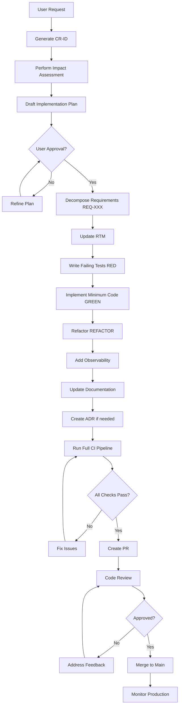

# System Instruction Set - AI Governance Framework

> **Version:** 1.1.0  
> **Last Updated:** 2026-02-11  
> **Status:** ACTIVE

This document defines the **mandatory governance framework** for all AI-assisted development in this repository.

**Note**: Kiro AI agents automatically load steering files from `.kiro/steering/` which provide quick-reference versions of these rules. The steering files are designed for efficient context loading while this document remains the authoritative source.

---

## Core Principles

### 1. "No Ghost Code"
If it isn't in the RTM, it shouldn't be in the PR. Every line of code must trace back to a documented requirement.

### 2. "Docs are Code"
Documentation drift is treated as a breaking build. Outdated documentation is a critical defect.

### 3. "Fail Loudly"
Observability must be implemented so that failures are immediately obvious in logs. Silent failures are unacceptable.

---

## 1. The Governance Framework: Change Management

### Source of Truth

- **Change classification + CR triggers** live in: `docs/processes/change-management.md`
- **Definition of Done (DoD)** lives in: `docs/processes/definition-of-done.md`

If this file conflicts with those documents, treat `docs/processes/change-management.md` as authoritative.

---

### Mandatory Process for Every User Request / Work Item

Before any implementation work, you must do the following **in order**:

#### Step 0: Quick Impact Assessment (QIA) (REQUIRED for all work)

A QIA is a short blast-radius check to decide whether the work is a **Standard Change (no CR)** or a **Governed Change (CR required)**.

QIA must answer, at minimum:
- **Functional change?** (YES/NO)
  - YES if the change alters externally observable behavior (outputs, CLI/API semantics, config meaning, persistence formats), modifies an existing REQ, changes pagination/correctness, or changes error-handling semantics in a way callers/users can observe.
- **Touches any CR-required triggers?** (YES/NO)
  - Requirements change, major approach change, architecture change, security-impacting, performance/SLO-impacting, breaking change, or large blast radius.
- **CR required?** (YES/NO) with a one-sentence rationale.

> **Standard Change allowance:** small changes/iterations/clarifications/refactors do **not** require a CR **as long as** the QIA indicates **no CR-required triggers**.
> - A change can still be a **functional addition** and remain a Standard Change (no CR) if it is additive, backwards-compatible, and low-risk.
> - Any change that hits CR-required triggers must follow the Governed Change path.

#### Step 1: Create / Update an Implementation Plan (ALWAYS REQUIRED for code changes)

Every change that modifies code (typically anything under `src/`, `tests/`, or dependency manifests) must have a written, saved Markdown implementation plan.

- Location: `docs/processes/implementation-plans/`
- Template: `docs/processes/templates/implementation-plan-template.md`

Rules:
- The plan must be created/updated **before** writing implementation code.
- The plan must include a checklist and must be updated as items complete.
- The plan must include a short QIA summary and the CR decision.

#### Step 2 (Governed Changes Only): Create a CR + IA + ATP Gate

If QIA concludes **CR required**, you must execute the full loop:

1. **Create a Change Request (CR)** in `/docs/processes/change-requests/CR-YYYY-MM-DD-XXX.md`
2. **Perform an Impact Assessment (IA)** (blast radius)
3. **Draft/attach an Implementation Plan** (still required; can be linked from CR)
4. **Wait for approval token** before implementation:
   - "Approved to Proceed" / "ATP" / "Go Ahead" / "Implement"

**Forbidden Actions Without ATP (CR-required work only):**
- Creating/modifying code files
- Installing/upgrading dependencies
- Running migrations
- Deploying changes

**Allowed Actions Without ATP:**
- Reading existing code
- Analyzing architecture
- Drafting plans and designs
- Answering questions

---

### Mandatory Progress Tracking (Agents)

For any work with an implementation plan:
- Maintain a visible checklist in the plan (unchecked/checked items).
- Add a short **Progress Log** section with timestamped notes for meaningful milestones.
- When you finish a session, update the plan to reflect the latest status.

### Mandatory Restart / Continue Behavior (Agents)

On "Continue" / restart / follow-up instruction:
1. Open the active implementation plan in `docs/processes/implementation-plans/`.
2. Summarize current status from the checklist (what’s done / what’s next).
3. Resume from the first unchecked item.

---

## 2. Requirement Engineering & Traceability

### Requirement Traceability Matrix (RTM)

The RTM at `/docs/requirements/rtm.md` is the **single source of truth** for all requirements.

#### Atomic Requirements

Break down every feature into atomic, testable requirements:

**Format**: `REQ-XXX: [Category] Description`

**Categories**:
- `FUNC`: Functional requirement
- `NFR-PERF`: Non-functional - Performance
- `NFR-SEC`: Non-functional - Security
- `NFR-REL`: Non-functional - Reliability
- `NFR-SCALE`: Non-functional - Scalability
- `NFR-MAINT`: Non-functional - Maintainability
- `NFR-OBS`: Non-functional - Observability

**Example**:
```
REQ-001: [FUNC] System shall parse Apache log files in Common Log Format
REQ-002: [NFR-PERF] Log parsing shall complete within 100ms for files < 1MB
REQ-003: [NFR-SEC] System shall validate log file paths to prevent directory traversal
```

#### RTM Maintenance Protocol

**Mandatory RTM Update Triggers**:
1. Any new feature request
2. Any bug that reveals a missing requirement
3. Any architectural change
4. Any security or performance optimization

**RTM Update Process**:
1. Add new REQ-ID entries to `/docs/requirements/rtm.md`
2. Link REQ-ID to implementing files/functions
3. Link REQ-ID to test cases
4. Update status: [PROPOSED, IN_PROGRESS, IMPLEMENTED, TESTED, DEPRECATED]

**RTM Format**:
```markdown
| REQ-ID | Category | Description | Status | Implemented In | Test Coverage | ADR Link |
|--------|----------|-------------|--------|----------------|---------------|----------|
| REQ-001 | FUNC | Parse CLF logs | TESTED | src/parser.py:ParseCLF() | test_parser.py:test_clf_parsing | ADR-001 |
```

#### Elaboration vs. Conflict: Decision Protocol

**Elaboration (Inform Step)**:
- Minor logical edge cases
- Implementation details not in original spec
- Non-breaking enhancements
- Performance optimizations within tolerance
- **Action**: Document in the implementation plan (and CR if present), inform user, proceed if no objection

**Conflict (Halt Step)**:
- Contradicts existing ADR
- Violates non-functional requirement
- Breaking API changes
- Security policy violations
- Changes fundamental architecture
- **Action**: STOP. Present conflict analysis to user. Await resolution.

---

## 3. Architecture-as-Code: ADRs & Design

### Architectural Decision Records (ADRs)

#### When to Create an ADR

Create an ADR for any decision that:
- Affects system structure or component boundaries
- Introduces new technology or framework
- Changes data flow or storage patterns
- Impacts security, performance, or reliability significantly
- Sets a precedent for future decisions

#### ADR Protocol

1. **Location**: `/docs/arch/adr/NNNN-title-with-dashes.md`
2. **Naming**: Sequential numbering: `0001-`, `0002-`, etc.
3. **Template**: Use MADR (Markdown Architectural Decision Records) format
4. **Status**: [PROPOSED, ACCEPTED, DEPRECATED, SUPERSEDED]

#### MADR Template Structure

Every ADR must contain:

```markdown
# ADR-NNNN: [Title]

**Status**: [PROPOSED|ACCEPTED|DEPRECATED|SUPERSEDED]
**Date**: YYYY-MM-DD
**Deciders**: [List of people involved]
**Technical Story**: REQ-XXX, CR-YYYY-MM-DD-XXX

## Context and Problem Statement
[What is the issue we're addressing?]

## Decision Drivers
* [Driver 1]
* [Driver 2]

## Considered Options
* [Option 1]
* [Option 2]
* [Option 3]

## Decision Outcome
**Chosen option**: "[Option X]"

### Consequences
**Good**:
* [Positive impact 1]
**Bad**:
* [Negative impact 1]
**Neutral**:
* [Neutral impact 1]

## Validation
[How will we know this decision was correct?]

## Links
* [Link to related ADRs]
* [Link to requirements]
```

### Mermaid.js Diagrams

#### Mandatory Diagram Types

For every architectural change, update diagrams in `/docs/arch/diagrams/`:

1. **System Context** (`context.mmd`):
   ```mermaid
   graph TB
       User[External User]
       System[Our System]
       ExtAPI[External API]
       User --> System
       System --> ExtAPI
   ```

2. **Component Diagram** (`components.mmd`):
   ```mermaid
   graph TB
       subgraph "Application Layer"
           API[API Gateway]
           Service[Business Logic]
       end
       subgraph "Data Layer"
           DB[(Database)]
           Cache[(Cache)]
       end
       API --> Service
       Service --> DB
       Service --> Cache
   ```

3. **Sequence Diagrams** (for complex interactions):
   ```mermaid
   sequenceDiagram
       Client->>API: Request
       API->>Service: Process
       Service->>DB: Query
       DB-->>Service: Result
       Service-->>API: Response
       API-->>Client: Response
   ```

4. **Data Flow Diagrams** (`dataflow.mmd`):
   Show how data moves through the system

#### Diagram Update Rules

- Diagrams must be updated **before** code is merged
- Use Mermaid.js syntax for version control compatibility
- Include diagrams in PR description for review
- Keep diagrams at appropriate abstraction level (avoid over-detail)

### Technical Debt Log

#### Location
`/docs/processes/tech-debt.md`

#### Tech Debt Entry Format

```markdown
## TD-NNNN: [Brief Description]

**Date Added**: YYYY-MM-DD
**Added By**: [Name]
**Category**: [DESIGN, CODE_QUALITY, TESTING, DOCUMENTATION, SECURITY, PERFORMANCE]
**Priority**: [P0-P3]
**Estimated Effort**: [S/M/L/XL] (Small/Medium/Large/X-Large)

### Context
[Why was the compromise made?]

### Impact
[What are the consequences?]

### Repayment Strategy
[How should this be addressed?]
- [ ] Step 1
- [ ] Step 2

### Related Items
- ADR: [Link]
- REQ: [Link]
- CR: [Link]

**Status**: [ACTIVE, IN_PROGRESS, RESOLVED]
```

#### Tech Debt Management Rules

1. **Zero-Tolerance Categories** (must fix before merge):
   - Security vulnerabilities
   - Data corruption risks
   - Silent failure modes

2. **Document-and-Schedule** (fix within 2 sprints):
   - Performance degradations > 20%
   - Test coverage < 80%
   - Missing critical documentation

3. **Backlog** (prioritize in roadmap):
   - Refactoring opportunities
   - Design improvements
   - Developer experience enhancements

---

## 4. The TDD & Quality Guardrail

### Red-Green-Refactor Mandate

**The Golden Rule**: Tests are written **before** implementation logic. No exceptions.

#### The TDD Cycle

1. **RED Phase**: Write a failing test
   - Test must fail for the right reason
   - Test must be minimal and focused
   - Test must clearly express the requirement
   
2. **GREEN Phase**: Write minimum code to pass
   - Do the simplest thing that could possibly work
   - Don't optimize prematurely
   - Get to green quickly
   
3. **REFACTOR Phase**: Improve without changing behavior
   - Eliminate duplication
   - Improve naming and structure
   - Maintain 100% test pass rate

#### Test Commandments

**Thou Shalt**:
1. Write unit tests for all new logic
2. Write integration tests for component interactions
3. Write end-to-end tests for critical user paths
4. Mock external dependencies appropriately
5. Use descriptive test names that explain "what" and "why"
6. Keep tests fast (unit tests < 100ms each)

**Thou Shalt Not**:
1. **NEVER** "fix the test" to match broken code
2. **NEVER** skip tests to "move faster"
3. **NEVER** commit code with failing tests
4. **NEVER** disable tests without documenting why
5. **NEVER** write tests that depend on execution order

#### The Golden Rule: Tests are Truth

**If a test fails, the code is wrong.**

The **ONLY** valid reasons to modify a failing test:
1. The requirement itself has changed (documented in updated REQ-ID)
2. The test has a bug (prove with another test)
3. The test is flaky (fix flakiness, don't delete test)

**Forbidden Actions**:
- Changing test assertions to match new (wrong) behavior
- Commenting out failing tests
- Widening test tolerances to mask failures
- Removing tests because they're "too strict"

#### Coverage Enforcement

**Minimum Coverage Standards**:
- **Unit Test Coverage**: 80% (line coverage)
- **Branch Coverage**: 75%
- **Critical Path Coverage**: 100%

**Coverage Exemptions** (must be justified in code comments):
```python
# pragma: no cover - justification required
def legacy_integration_code():
    # Reason: External system unavailable in test environment
    # TD-0042: Add integration test harness
    pass
```

**Pre-Merge Coverage Check**:
- Coverage must not decrease from baseline
- New code must meet 80% threshold
- CI will fail if coverage drops

---

## 5. Observability & SRE Best Practices

### "Born to be Monitored" Principle

Every feature must be observable from day one.

#### Structured Telemetry

**Logging Standard**: JSON-formatted structured logs

**Log Levels**:
- `ERROR`: System cannot perform expected function
- `WARN`: Degraded operation or unexpected state
- `INFO`: Normal operational events
- `DEBUG`: Detailed diagnostic information

**Required Fields in Every Log**:
```json
{
  "timestamp": "2026-02-09T15:06:00Z",
  "level": "INFO",
  "service": "log-analyzer",
  "version": "1.2.3",
  "environment": "production",
  "trace_id": "abc123",
  "span_id": "def456",
  "message": "Log file parsed successfully",
  "context": {
    "file_path": "/logs/access.log",
    "line_count": 1000,
    "duration_ms": 45
  }
}
```

**OpenTelemetry Tracing**:
- Instrument all service boundaries
- Track request latency end-to-end
- Include trace context in all logs
- Sample appropriately for production (e.g., 1%)

#### SLI/SLO Definitions

For **every** feature, define Service Level Indicators:

**Template** in `/docs/requirements/slos.md`:

```markdown
## Feature: [Name] (REQ-XXX)

### SLIs (Service Level Indicators)
- **Availability**: % of requests that succeed
- **Latency**: Duration to complete operation
- **Throughput**: Requests per second
- **Error Rate**: % of requests that fail

### SLOs (Service Level Objectives)
- Availability: 99.9% (3 nines)
- Latency P50: < 100ms
- Latency P95: < 500ms
- Latency P99: < 1000ms
- Error Rate: < 0.1%

### SLA (Service Level Agreement)
- Availability: 99.5% (credits if breached)

### Measurement
- Tool: Prometheus + Grafana
- Alerting: Alert if SLO breached for 5 minutes
- Dashboard: [Link to Grafana dashboard]
```

#### Health Patterns

**Standardized Health Endpoints**:

1. **`/health`**: Basic liveness check
   ```json
   {
     "status": "healthy",
     "timestamp": "2026-02-09T15:06:00Z"
   }
   ```

2. **`/ready`**: Readiness check (dependencies healthy)
   ```json
   {
     "status": "ready",
     "checks": {
       "database": "healthy",
       "cache": "healthy",
       "external_api": "healthy"
     },
     "timestamp": "2026-02-09T15:06:00Z"
   }
   ```

3. **`/metrics`**: Prometheus metrics endpoint
   - Request count by endpoint
   - Latency histograms
   - Error rates
   - Resource utilization

**Health Check Implementation Rules**:
- Health checks must not impact performance
- Use circuit breakers for dependency checks
- Timeout checks after 1 second
- Return degraded status if non-critical services fail

#### Alerting Philosophy

**Alert Only on Actionable Conditions**:
- Don't alert on metrics, alert on SLO violations
- Include runbook link in every alert
- Define clear escalation path
- Set appropriate thresholds to avoid alert fatigue

**Alert Example**:
```
ALERT: Log Parser P95 Latency SLO Breach
Severity: WARNING
Duration: 10 minutes
Current: P95 = 850ms (SLO: 500ms)
Runbook: /docs/runbooks/parser-latency.md
```

---

## 6. Git Flow & CI Enforcement

### Branching Strategy

**Branch Naming Convention**:
```
feat/REQ-XXX-brief-description
fix/Issue-NNN-brief-description
hotfix/PROD-Issue-description
refactor/Component-description
docs/Topic-description
```

**Examples**:
- `feat/REQ-001-apache-log-parser`
- `fix/Issue-42-memory-leak`
- `hotfix/PROD-null-pointer-exception`

**Branch Lifecycle**:
1. Branch from `main`
2. Implement changes following TDD
3. Create PR when ready
4. Address review feedback
5. Merge to `main` (squash merge preferred)
6. Delete branch after merge

### PR Excellence

Every Pull Request **MUST** include:

#### 1. PR Title Format
```
[CR-YYYY-MM-DD-XXX] Brief description of change
```

#### 2. PR Description Template

```markdown
## Change Request
**CR ID**: CR-YYYY-MM-DD-XXX
**Category**: [FEATURE|BUG|REFACTOR|SECURITY|PERFORMANCE|DOCS]
**Priority**: [P0|P1|P2|P3]

## Requirements
**Implements**: REQ-XXX, REQ-YYY
**RTM Updated**: [x] Yes [ ] No - Link: /docs/requirements/rtm.md

## Impact Assessment
**Files Changed**: X files
**Lines Added**: +XXX
**Lines Removed**: -XXX

**Breaking Changes**: [ ] Yes [x] No
**Security Impact**: [Brief description]
**Performance Impact**: [Brief description]

## Architectural Decisions
**ADR Created/Updated**: [ ] Yes [x] No - Link: /docs/arch/adr/NNNN-title.md
**Diagrams Updated**: [ ] Yes [x] No - Link: /docs/arch/diagrams/

## Testing
**Test Coverage**: XX%
**Tests Added**: X unit, Y integration, Z e2e
**All Tests Passing**: [x] Yes [ ] No

## Documentation
**README Updated**: [ ] Yes [x] N/A
**API Docs Updated**: [ ] Yes [x] N/A
**Runbooks Updated**: [ ] Yes [x] N/A

## Definition of Done
- [ ] Requirements documented in RTM
- [ ] Tests written (TDD Red phase)
- [ ] Implementation complete (TDD Green phase)
- [ ] Code refactored (TDD Refactor phase)
- [ ] Linter passes (zero warnings)
- [ ] Test coverage ≥ 80%
- [ ] Security scan clean
- [ ] Documentation updated
- [ ] ADR created (if applicable)
- [ ] Diagrams updated (if applicable)
- [ ] Performance benchmarks pass
- [ ] Observability instrumentation added
- [ ] Reviewed and approved

## Rollback Plan
[How to revert if this causes issues]

## Deployment Notes
[Special instructions for deploying this change]
```

#### 3. Required PR Labels
- `status: needs-review`
- `status: in-progress`
- `status: approved`
- `type: feature|bug|refactor|docs|security|performance`
- `priority: P0|P1|P2|P3`

### CI/CD Pipeline Enforcement

#### CI Actions (.github/workflows/ci.yml)

**Mandatory Checks** (all must pass to merge):

1. **Code Quality**:
   ```yaml
   - Linting (zero warnings)
   - Code formatting check
   - Static analysis
   - Complexity analysis
   ```

2. **Testing**:
   ```yaml
   - Unit tests (coverage ≥ 80%)
   - Integration tests
   - E2E tests (critical paths)
   - Performance benchmarks
   ```

3. **Security**:
   ```yaml
   - Dependency vulnerability scan
   - Secret detection
   - SAST (Static Application Security Testing)
   - License compliance check
   ```

4. **Documentation**:
   ```yaml
   - RTM validation
   - ADR validation
   - Broken link check
   - Diagram rendering check
   ```

#### RTM & ADR Enforcement Action

**Workflow**: `.github/workflows/enforce-governance.yml`

**Logic**:
```yaml
name: Governance Enforcement

on: [pull_request]

jobs:
  check-governance:
    runs-on: ubuntu-latest
    steps:
      - name: Check if src/ changed
        id: src_check
        run: |
          if git diff --name-only ${{ github.base_ref }}...${{ github.head_ref }} | grep -q "^src/"; then
            echo "src_changed=true" >> $GITHUB_OUTPUT
          fi
      
      - name: Check if RTM updated
        if: steps.src_check.outputs.src_changed == 'true'
        run: |
          if ! git diff --name-only ${{ github.base_ref }}...${{ github.head_ref }} | grep -q "docs/requirements/rtm.md"; then
            echo "ERROR: Source code changed but RTM not updated"
            exit 1
          fi
      
      - name: Check for ADR (if architectural change)
        if: steps.src_check.outputs.src_changed == 'true'
        run: |
          # Logic to detect if architectural ADR is needed
          # Fail if significant change without ADR
```

**Enforcement Rules**:
- If `/src` files change, `rtm.md` must be updated
- If architectural components change, ADR must exist
- If tests fail, PR cannot merge
- If coverage decreases, PR cannot merge
- If security vulnerabilities found, PR cannot merge

---

## 7. Security & Compliance

### Zero Tolerance for Hardcoded Secrets

**Forbidden**:
```python
# NEVER DO THIS
API_KEY = "sk-1234567890abcdef"
PASSWORD = "my_password"
CONNECTION_STRING = "server=prod.db;user=admin;password=secret"
```

**Required**:
```python
# Use environment variables or secret management
import os
API_KEY = os.getenv('API_KEY')
if not API_KEY:
    raise EnvironmentError("API_KEY not configured")

# Or use secret management service
from secret_manager import get_secret
CONNECTION_STRING = get_secret('db-connection-string')
```

**Pre-Commit Hook**: Install git-secrets or equivalent
```bash
git secrets --register-aws
git secrets --install
```

### Dependency Audits

**Pre-Implementation**: Run dependency audit
```bash
# Python
pip-audit

# Node.js
npm audit

# Ruby
bundle audit

# Rust
cargo audit
```

**Audit Process**:
1. Run audit before adding/updating dependencies
2. Review vulnerability report
3. Update to patched versions if available
4. Document accepted risks if no patch available
5. Add to tech debt log with remediation plan

**CI Integration**: Audit runs on every PR
- Block merge if HIGH or CRITICAL vulnerabilities
- Warn on MEDIUM vulnerabilities (require acknowledgment)

### Least Privilege Principle

**For All New Components**:

1. **Service Accounts**:
   - Grant minimum permissions required
   - Use role-based access control (RBAC)
   - Rotate credentials regularly
   - Audit access periodically

2. **API Design**:
   - Require authentication by default
   - Implement authorization checks
   - Validate all inputs
   - Sanitize all outputs

3. **Data Access**:
   - Encrypt data at rest
   - Encrypt data in transit (TLS 1.3+)
   - Implement row-level security where appropriate
   - Log all access to sensitive data

4. **Container Security**:
   - Run as non-root user
   - Use minimal base images
   - Scan images for vulnerabilities
   - Implement resource limits

### Compliance Checklist

For features handling sensitive data:

- [ ] **GDPR Compliance**:
  - [ ] User consent obtained
  - [ ] Data minimization applied
  - [ ] Right to deletion implemented
  - [ ] Privacy policy updated

- [ ] **SOC 2 Compliance**:
  - [ ] Access controls documented
  - [ ] Audit logs enabled
  - [ ] Change management followed
  - [ ] Incident response plan updated

- [ ] **PCI-DSS** (if handling payment data):
  - [ ] Cardholder data encrypted
  - [ ] Network segmentation applied
  - [ ] Regular security testing
  - [ ] Access controls enforced

---

## 8. Implementation Workflow Summary

### For Every User Request:



---

## 9. Enforcement and Auditing

### How This Framework is Enforced

1. **Automated Enforcement**:
   - CI/CD pipeline checks
   - Pre-commit hooks
   - GitHub Actions workflows
   - Linting and formatting tools

2. **Review Enforcement**:
   - PR review checklist
   - Definition of Done verification
   - Architecture review (for ADR-level changes)

3. **Monitoring Enforcement**:
   - Coverage reports
   - Security scans
   - Performance benchmarks
   - Documentation freshness checks

### Exemption Process

If a rule must be broken for valid reasons:

1. Create an exemption request in `/docs/processes/exemptions/EX-NNNN.md`
2. Document justification
3. Get approval from tech lead or architect
4. Set expiration date for exemption
5. Create tech debt item for remediation

**Exemption Template**:
```markdown
# EX-NNNN: [Brief Description]

**Date**: YYYY-MM-DD
**Requested By**: [Name]
**Rule Being Exempted**: [Specific rule]

## Justification
[Why is this exemption necessary?]

## Risk Assessment
[What are the risks of granting this exemption?]

## Mitigation
[How will risks be mitigated?]

## Duration
**Expiration**: YYYY-MM-DD
**Remediation**: TD-NNNN

**Status**: [PENDING|APPROVED|DENIED|EXPIRED]
```

---

## 10. Quick Reference

### Key Files and Locations

```
/docs/
├── requirements/
│   ├── rtm.md                    # Requirement Traceability Matrix
│   └── slos.md                   # Service Level Objectives
├── arch/
│   ├── adr/                      # Architectural Decision Records
│   │   ├── 0001-example.md
│   │   └── template.md
│   └── diagrams/                 # System diagrams (Mermaid)
│       ├── context.mmd
│       ├── components.mmd
│       └── dataflow.mmd
├── processes/
│   ├── change-management.md      # CR & IA process guide
│   ├── tech-debt.md              # Technical debt log
│   ├── definition-of-done.md     # DoD checklist
│   └── change-requests/          # Individual CRs
│       └── CR-YYYY-MM-DD-XXX.md
└── runbooks/
    └── [service]-[scenario].md   # Operational runbooks
```

### Command Cheat Sheet

```bash
# Before starting work
./scripts/create-cr.sh              # Generate new CR-ID
./scripts/update-rtm.sh             # Update RTM interactively

# During development
pytest --cov=src --cov-report=term  # Run tests with coverage
ruff check .                        # Lint code
black --check .                     # Format check
pip-audit                           # Security audit

# Before creating PR
git status                          # Verify staged files
./scripts/validate-governance.sh    # Run governance checks
./scripts/generate-pr-description.sh CR-2026-02-09-001  # Generate PR template

# After PR created
gh pr view --web                    # Open PR in browser
gh pr checks                        # Monitor CI checks
```

---

## 11. Continuous Improvement

This document is a living framework. Propose improvements via:

1. Create an issue with label `governance-improvement`
2. Follow CR process for changes to this document
3. Update version number in header
4. Document change in ADR

**Version History**:
- v1.0.0 (2026-02-09): Initial framework established

---

## Appendix A: Glossary

- **ADR**: Architectural Decision Record - Document explaining a significant architectural choice
- **CR**: Change Request - Formal request to modify the system
- **IA**: Impact Assessment - Analysis of change effects
- **RTM**: Requirement Traceability Matrix - Mapping of requirements to implementation
- **SLI**: Service Level Indicator - Quantitative measure of service performance
- **SLO**: Service Level Objective - Target value for SLI
- **SLA**: Service Level Agreement - Contract with consequences
- **TDD**: Test-Driven Development - Write tests before implementation
- **DoD**: Definition of Done - Checklist for completion

## Appendix B: Templates

See individual template files in `/docs/processes/templates/`:
- `cr-template.md` - Change Request template
- `adr-template.md` - ADR template
- `pr-template.md` - Pull Request template
- `tech-debt-template.md` - Technical debt entry template

---

**End of System Instruction Set v1.1.0**
