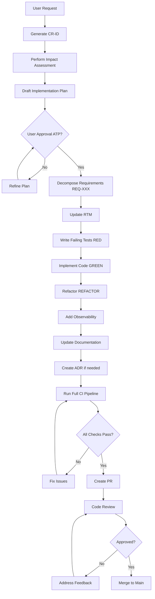

# Governance Framework Implementation Summary

This repository now has a comprehensive, enterprise-grade governance framework for AI-assisted development.

## 📊 What Was Implemented

### Core Governance Document
- **`.github/copilot-instructions.md`** (1,046 lines, 27KB)
  - Complete system instruction set for AI interactions
  - Covers all 7 domains requested:
    1. Change Management Loop (CR & IA)
    2. Requirement Engineering & Traceability (RTM)
    3. Architecture-as-Code (ADRs & Design)
    4. TDD & Quality Guardrail
    5. Observability & SRE Best Practices
    6. Git Flow & CI Enforcement
    7. Security & Compliance

### Documentation Structure (12 files, ~140KB total)

#### Requirements & Objectives
- `docs/requirements/rtm.md` (314 lines) - Requirement Traceability Matrix
- `docs/requirements/slos.md` (599 lines) - Service Level Objectives

#### Architecture
- `docs/arch/adr-template.md` (320 lines) - MADR-format ADR template

#### Processes
- `docs/processes/change-management.md` (819 lines) - CR & IA process
- `docs/processes/definition-of-done.md` (553 lines) - DoD checklist
- `docs/processes/tech-debt.md` (516 lines) - Technical debt tracking
- `docs/processes/QUICKSTART.md` (267 lines) - Quick reference for developers
- `docs/processes/templates/cr-template.md` (158 lines) - CR template

#### Supporting Documentation
- `docs/README.md` (306 lines) - Documentation index and guide
- `README.md` (373 lines) - Repository main README

#### GitHub Integration
- `.github/pull_request_template.md` (58 lines) - PR template
- `.github/workflows/governance-enforcement.yml` (368 lines) - CI enforcement

### Directory Structure Created

```
.github/
├── copilot-instructions.md
├── pull_request_template.md
└── workflows/
    └── governance-enforcement.yml

docs/
├── README.md
├── requirements/
│   ├── rtm.md
│   └── slos.md
├── arch/
│   ├── adr-template.md
│   ├── adr/                    (empty, ready for ADRs)
│   └── diagrams/               (empty, ready for diagrams)
├── processes/
│   ├── change-management.md
│   ├── definition-of-done.md
│   ├── tech-debt.md
│   ├── QUICKSTART.md
│   ├── templates/
│   │   └── cr-template.md
│   ├── change-requests/        (empty, ready for CRs)
│   └── exemptions/             (empty, ready for exemptions)
└── runbooks/                   (empty, ready for runbooks)
```

## ✅ Requirements Coverage

### 1. Governance Framework (CR & IA) ✓
- **Change Request Protocol**: Unique CR-ID format (CR-YYYY-MM-DD-XXX)
- **Impact Assessment**: Complete blast radius analysis template
- **Implementation Plan**: Step-by-step checklist methodology
- **Human-in-the-Loop Gate**: "Approved to Proceed" (ATP) token requirement

### 2. Requirement Engineering & Traceability ✓
- **Atomic Requirements**: REQ-XXX format with categories
- **RTM Maintenance**: Complete template with traceability
- **Elaboration vs. Conflict**: Clear decision boundaries defined
- **Enforcement**: CI checks RTM updates when code changes

### 3. Architecture-as-Code (ADRs & Design) ✓
- **ADR Protocol**: MADR template format
- **Mermaid.js Diagrams**: Context, component, sequence, and data flow
- **Tech Debt Log**: Complete tracking with repayment strategies
- **Enforcement**: CI validates ADR presence for architectural changes

### 4. TDD & Quality Guardrail ✓
- **Red-Green-Refactor**: Mandatory TDD workflow
- **The Golden Rule**: Tests are truth, code is wrong if tests fail
- **Coverage Enforcement**: 80% minimum threshold
- **Quality Gates**: Linting, formatting, complexity checks

### 5. Observability & SRE Best Practices ✓
- **Structured Telemetry**: JSON logging + OpenTelemetry tracing
- **SLI/SLO Definitions**: Complete template with examples
- **Health Patterns**: /health, /ready, /metrics endpoints
- **Error Budgets**: Budget calculation and management policy

### 6. Git Flow & CI Enforcement ✓
- **Branching**: feat/REQ-ID or fix/Issue-ID convention
- **PR Excellence**: Complete template with CR-ID, RTM link, DoD checklist
- **CI Actions**: GitHub Action enforces RTM and ADR updates
- **Automation**: Link checking, diagram validation, format checking

### 7. Security & Compliance ✓
- **Secret Management**: Zero tolerance for hardcoded keys
- **Dependency Audits**: Pre-implementation audit requirement
- **Least Privilege**: Complete guidelines and checklist
- **Compliance**: GDPR, SOC2, PCI-DSS checklists

## 🎯 Key Principles Implemented

### "No Ghost Code"
CI enforces RTM updates when source code changes. Nothing gets merged without requirements.

### "Docs are Code"
Documentation updates required alongside code changes. CI validates this.

### "Fail Loudly"
Observability requirements mandated for all features from day one.

## 🔄 The Complete Workflow



## 🤖 CI/CD Enforcement

The GitHub Action workflow enforces:
1. **RTM Updates**: Fails if src/ changes but rtm.md doesn't
2. **ADR Warnings**: Warns if architectural components change without ADR
3. **Documentation Checks**: Validates docs updated with code
4. **Link Validation**: Ensures no broken internal links
5. **Diagram Validation**: Validates Mermaid.js syntax
6. **PR Format**: Validates PR title includes CR-ID

## 📈 Metrics and Statistics

**Total Documentation**: ~4,200 lines across 12 files
**Total Size**: ~140KB of governance documentation
**Template Count**: 3 (CR, ADR, PR)
**Process Documents**: 4 (Change Mgmt, DoD, Tech Debt, Quick Start)
**CI Workflows**: 1 (with 6 enforcement jobs)
**Directory Structure**: 9 directories created

## 🚀 How to Use This Framework

### For Developers
1. Read `.github/copilot-instructions.md` (mandatory)
2. Review `docs/processes/QUICKSTART.md` for quick reference
3. Follow the change management loop for every request
4. Use templates in `docs/processes/templates/`

### For AI Assistants
1. **Always** read `.github/copilot-instructions.md` at session start
2. Follow the governance framework for every user request
3. Generate CR, perform IA, draft plan, wait for ATP
4. Never skip TDD or quality gates
5. Update RTM and create ADRs as required

### For Project Managers
1. Review CRs in `docs/processes/change-requests/`
2. Assess impact and priority
3. Provide ATP token when approved
4. Monitor progress via PRs

### For Architects
1. Review ADRs in `docs/arch/adr/`
2. Maintain diagrams in `docs/arch/diagrams/`
3. Ensure RTM reflects architecture
4. Guide technical decisions

## 🎓 Training Resources

New to this framework? Start here:
1. **5-Minute Overview**: `docs/processes/QUICKSTART.md`
2. **Complete Guide**: `.github/copilot-instructions.md`
3. **Process Details**: `docs/processes/change-management.md`
4. **Quality Standards**: `docs/processes/definition-of-done.md`

## 🔧 Maintenance

### Weekly
- Review new CRs
- Update RTM for completed work
- Monitor CI enforcement

### Monthly
- Review tech debt log
- Check SLO compliance
- Update documentation as needed

### Quarterly
- Review and update ADRs
- Comprehensive SLO review
- Documentation quality audit
- Process improvement review

## 📝 Next Steps

1. **Customize Templates**: Adjust templates to match your specific needs
2. **Add Examples**: Create example ADRs and CRs to show the process
3. **Team Training**: Train team on the governance framework
4. **Tool Integration**: Integrate with your existing tools (JIRA, etc.)
5. **Continuous Improvement**: Gather feedback and refine the process

## ✨ Benefits of This Framework

- **Quality Assurance**: TDD and 80% coverage mandatory
- **Traceability**: Every line of code traces to a requirement
- **Documentation**: Always up-to-date, treated as code
- **Architecture**: Decisions documented with rationale
- **Security**: Zero tolerance for vulnerabilities
- **Observability**: Built-in from day one
- **Compliance**: Ready for audits (GDPR, SOC2, etc.)
- **Predictability**: Structured process reduces surprises
- **Learning**: New developers have clear guidelines
- **Automation**: CI enforces standards automatically

## 🎉 Success Criteria

You'll know the framework is working when:
- ✅ Every PR has a CR-ID
- ✅ RTM is always current
- ✅ Test coverage stays ≥ 80%
- ✅ No secrets in code
- ✅ Documentation matches reality
- ✅ ADRs explain major decisions
- ✅ CI passes consistently
- ✅ Production incidents decrease
- ✅ Code reviews are faster
- ✅ Onboarding is smoother

## 📞 Support

Questions? Check:
1. `docs/processes/QUICKSTART.md` - Quick answers
2. `.github/copilot-instructions.md` - Complete framework
3. `docs/README.md` - Documentation index
4. Create an issue if stuck

---

**Framework Version**: 1.0.0  
**Created**: 2026-02-09  
**Status**: Production Ready ✅

**Remember**: This framework is a living document. Propose improvements through the same governance process it defines!
