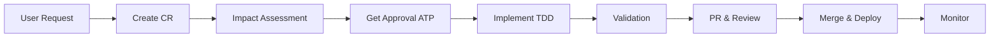

# Log-Analysis

A comprehensive log analysis system with enterprise-grade governance and quality controls.

---

## 📋 Governance Framework

This repository follows a comprehensive governance framework to ensure high-quality, maintainable, and reliable software development.

**Key Principle**: Every change follows a structured Change Management Loop with Impact Assessment and Human-in-the-Loop approval.

### Quick Start: Making Changes

1. **Read the Governance Framework**: [`.github/copilot-instructions.md`](./.github/copilot-instructions.md)
2. **Create a Change Request**: Follow [Change Management Process](./docs/processes/change-management.md)
3. **Get Approval**: Wait for "Approved to Proceed" (ATP) token
4. **Implement Using TDD**: Red → Green → Refactor
5. **Complete Definition of Done**: See [DoD Checklist](./docs/processes/definition-of-done.md)
6. **Submit PR**: Use the [PR template](./.github/pull_request_template.md)

---

## 📚 Documentation

Comprehensive documentation is located in the [`/docs`](./docs) directory:

### Essential Reading

- **[Copilot Instructions](./.github/copilot-instructions.md)**: AI governance framework *(START HERE)*
- **[Change Management](./docs/processes/change-management.md)**: How to request and implement changes
- **[Definition of Done](./docs/processes/definition-of-done.md)**: Completion checklist
- **[RTM](./docs/requirements/rtm.md)**: Requirement Traceability Matrix

### Reference Documentation

- **[ADR Template](./docs/arch/adr-template.md)**: Architectural decision records
- **[SLOs](./docs/requirements/slos.md)**: Service level objectives
- **[Technical Debt Log](./docs/processes/tech-debt.md)**: Known issues and remediation plans
- **[Documentation Index](./docs/README.md)**: Complete documentation guide

---

## 🏗️ Repository Structure

```
.
├── .github/
│   ├── copilot-instructions.md         # AI governance framework
│   ├── pull_request_template.md        # PR template
│   └── workflows/
│       └── governance-enforcement.yml  # Automated governance checks
├── docs/
│   ├── README.md                       # Documentation index
│   ├── requirements/
│   │   ├── rtm.md                     # Requirement Traceability Matrix
│   │   └── slos.md                    # Service Level Objectives
│   ├── arch/
│   │   ├── adr-template.md            # ADR template
│   │   ├── adr/                       # Architectural Decision Records
│   │   └── diagrams/                  # System diagrams (Mermaid.js)
│   ├── processes/
│   │   ├── change-management.md       # CR & IA process
│   │   ├── tech-debt.md              # Technical debt log
│   │   ├── definition-of-done.md     # DoD checklist
│   │   ├── templates/                # Document templates
│   │   ├── change-requests/          # Individual CRs
│   │   └── exemptions/               # Governance exemptions
│   └── runbooks/                      # Operational runbooks
├── src/                                # Source code
│   └── log_ingestion/                 # Log ingestion service
│       ├── __init__.py
│       ├── api_client.py              # Rapid7 API client
│       ├── config.py                  # Configuration management
│       ├── main.py                    # Main service entry point
│       ├── parser.py                  # CSV log parser
│       └── parquet_writer.py          # Parquet file writer
├── tests/                              # Tests
│   ├── __init__.py
│   ├── conftest.py                    # Pytest fixtures
│   ├── test_api_client.py             # API client tests
│   ├── test_config.py                 # Configuration tests
│   ├── test_integration.py            # Integration tests
│   ├── test_main.py                   # Main service tests
│   ├── test_parser.py                 # Parser tests
│   └── test_parquet_writer.py         # Parquet writer tests
└── README.md                           # This file
```

---

## 🚀 Features

### Log Ingestion Service

The repository includes a production-ready service for ingesting logs from Rapid7 InsightOps API and storing them in Apache Parquet format for analytics.

**Key Capabilities**:
- ✅ **API Integration**: Fetch logs from Rapid7 InsightOps with authentication and retry logic
- ✅ **Dynamic Schema**: Parse CSV logs with automatic schema detection
- ✅ **Parquet Storage**: Store logs in compressed Parquet format (70-90% size reduction)
- ✅ **Configuration**: Fully configurable via environment variables
- ✅ **Observability**: Structured JSON logging with trace context
- ✅ **Reliability**: Exponential backoff, rate limiting, error handling
- ✅ **Testing**: >80% test coverage with comprehensive test suite

**Quick Start**:
```bash
# Install dependencies
pip install -r requirements.txt

# Configure (see .env.example)
cp .env.example .env
# Edit .env with your Rapid7 API credentials

# Run service
python -m src.log_ingestion.main
```

**Documentation**:
- **[ADR-0001](./docs/arch/adr/0001-log-ingestion-tech-stack.md)**: Technology stack decisions
- **[Architecture Diagrams](./docs/arch/diagrams/log-ingestion.mmd)**: System architecture
- **[Runbook](./docs/runbooks/log-ingestion-service.md)**: Operations guide
- **[Requirements](./docs/requirements/rtm.md)**: REQ-004 through REQ-011

---

## 🎯 Core Principles

### 1. "No Ghost Code"
**If it isn't in the RTM, it shouldn't be in the PR.**

Every line of code must trace back to a documented requirement in the [RTM](./docs/requirements/rtm.md).

### 2. "Docs are Code"
**Documentation drift is treated as a breaking build.**

Documentation must be updated alongside code changes. The CI pipeline enforces this.

### 3. "Fail Loudly"
**Observability must be implemented so failures are immediately obvious.**

All features include structured logging, tracing, and metrics from day one.

---

## 🔄 Change Management Loop

Every change follows this mandatory process:



**Key Steps**:
1. **CR Creation**: Generate unique CR-ID and document the change
2. **Impact Assessment**: Analyze blast radius (code, security, performance)
3. **Human-in-the-Loop Gate**: Wait for "Approved to Proceed" token
4. **TDD Implementation**: Red → Green → Refactor
5. **Quality Gates**: Tests, linting, security, performance, documentation
6. **PR Review**: Code review with DoD verification
7. **Deployment**: Deploy with monitoring and rollback plan

---

## 🧪 Test-Driven Development (TDD)

**The Golden Rule**: Tests are written **before** implementation. No exceptions.

### TDD Cycle

1. **RED**: Write a failing test
2. **GREEN**: Write minimum code to pass
3. **REFACTOR**: Improve code quality

### Test Commandments

✅ **DO**:
- Write tests first (TDD Red phase)
- Keep tests fast (< 100ms per unit test)
- Achieve ≥ 80% coverage
- Use descriptive test names

❌ **DON'T**:
- Change tests to match broken code
- Skip tests to "move faster"
- Commit with failing tests

---

## 🔒 Security First

**Zero Tolerance for Hardcoded Secrets**

```python
# ❌ FORBIDDEN
API_KEY = "sk-1234567890abcdef"

# ✅ REQUIRED
API_KEY = os.getenv('API_KEY')
```

**Security Practices**:
- No hardcoded credentials
- Input validation on all inputs
- Dependency audits before adding/updating
- SAST scans in CI
- Least privilege principle

---

## 📊 Observability

All features must be observable from day one:

**Required Instrumentation**:
- ✅ **Structured JSON Logging**: With trace context
- ✅ **OpenTelemetry Tracing**: For distributed tracing
- ✅ **Metrics**: Request counts, latency, errors
- ✅ **Health Endpoints**: `/health`, `/ready`, `/metrics`
- ✅ **Alerting**: SLO-based alerts with runbooks

---

## 🚀 Getting Started

### For New Contributors

1. **Read the Governance Framework**:
   ```bash
   cat .github/copilot-instructions.md
   ```

2. **Review Key Documents**:
   - [Change Management](./docs/processes/change-management.md)
   - [Definition of Done](./docs/processes/definition-of-done.md)
   - [RTM](./docs/requirements/rtm.md)

3. **Set Up Development Environment**:
   ```bash
   # Coming soon: Installation instructions
   ```

4. **Make Your First Change**:
   - Create a Change Request
   - Wait for ATP (Approved to Proceed)
   - Follow TDD process
   - Submit PR with DoD checklist

### For Existing Team Members

**Before Starting Work**:
- [ ] Check [RTM](./docs/requirements/rtm.md) for existing requirements
- [ ] Review relevant [ADRs](./docs/arch/adr/)
- [ ] Check [Technical Debt Log](./docs/processes/tech-debt.md)

**During Development**:
- [ ] Follow TDD (Red-Green-Refactor)
- [ ] Update [RTM](./docs/requirements/rtm.md)
- [ ] Create [ADR](./docs/arch/adr/) if needed
- [ ] Add observability instrumentation

**Before PR**:
- [ ] Complete [Definition of Done](./docs/processes/definition-of-done.md)
- [ ] Run linters and tests
- [ ] Check security scan
- [ ] Verify documentation updated

---

## 🤖 CI/CD Pipeline

The CI/CD pipeline enforces governance automatically:

### Automated Checks

✅ **Code Quality**:
- Linting (zero warnings)
- Code formatting
- Complexity analysis

✅ **Testing**:
- Unit tests (≥ 80% coverage)
- Integration tests
- E2E tests

✅ **Security**:
- Dependency vulnerability scan
- Secret detection
- SAST analysis

✅ **Governance**:
- RTM validation (must update when src/ changes)
- ADR validation (for architectural changes)
- Documentation link checking
- Diagram validation

### Workflow Files

- [`.github/workflows/governance-enforcement.yml`](./.github/workflows/governance-enforcement.yml): Governance checks

---

## 📈 Metrics and SLOs

System health is measured against defined Service Level Objectives:

**System-Wide SLOs**:
- **Availability**: ≥ 99.9% (3 nines)
- **Latency P95**: < 500ms
- **Error Rate**: < 0.1%

See [SLOs Document](./docs/requirements/slos.md) for complete definitions.

---

## 🛠️ Development Workflow

### Standard Workflow

```bash
# 1. Create feature branch
git checkout -b feat/REQ-XXX-description

# 2. Write failing tests (Red)
# ... write tests ...

# 3. Implement feature (Green)
# ... write code ...

# 4. Refactor (Refactor)
# ... improve code ...

# 5. Run checks locally
make lint test security

# 6. Update documentation
# Update RTM, create ADR if needed

# 7. Commit and push
git add .
git commit -m "feat: implement REQ-XXX"
git push origin feat/REQ-XXX-description

# 8. Create PR
# Use PR template, include CR-ID
```

---

## 📝 Contributing

All contributions must follow the governance framework:

1. **No commits without CR**: Every change needs a Change Request
2. **ATP required**: Get "Approved to Proceed" before implementation
3. **TDD mandatory**: Tests before code
4. **DoD non-negotiable**: Complete all DoD items
5. **Reviews required**: All PRs need approval

See [Change Management Process](./docs/processes/change-management.md) for details.

---

## 📞 Support and Contact

**Questions about**:
- **Governance**: See [Copilot Instructions](./.github/copilot-instructions.md)
- **Changes**: See [Change Management](./docs/processes/change-management.md)
- **Requirements**: See [RTM](./docs/requirements/rtm.md)
- **Architecture**: See [ADRs](./docs/arch/adr/)

**Need Help?**:
1. Check documentation first
2. Ask in team chat
3. Create an issue
4. Escalate to tech lead

---

## 📜 License

[To be determined]

---

## 🙏 Acknowledgments

This governance framework implements industry best practices including:
- Test-Driven Development (TDD)
- Architectural Decision Records (ADRs) - MADR format
- Service Level Objectives (SLOs)
- Change Management processes
- Requirement Traceability Matrix (RTM)
- Technical Debt management

---

**Remember**: Quality is not optional. Follow the governance framework for every change.

**Quick Links**:
- [Governance Framework](./.github/copilot-instructions.md)
- [Documentation Index](./docs/README.md)
- [Change Management](./docs/processes/change-management.md)
- [Definition of Done](./docs/processes/definition-of-done.md)
