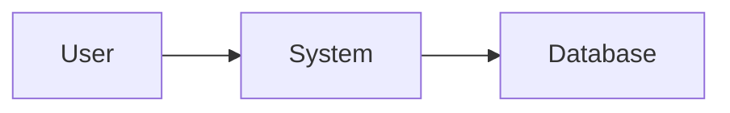

# Documentation

This directory contains all project documentation following the governance framework defined in `/.github/copilot-instructions.md`.

---

## Directory Structure

```
docs/
├── README.md                          # This file
├── requirements/                      # Requirements and objectives
│   ├── rtm.md                        # Requirement Traceability Matrix (RTM)
│   └── slos.md                       # Service Level Objectives (SLOs)
├── arch/                             # Architecture documentation
│   ├── adr-template.md               # ADR template
│   ├── adr/                          # Architectural Decision Records
│   │   └── NNNN-title.md            # Individual ADRs (numbered)
│   └── diagrams/                     # System diagrams (Mermaid.js)
│       ├── context.mmd              # System context diagram
│       ├── components.mmd           # Component diagram
│       └── dataflow.mmd             # Data flow diagram
├── processes/                        # Process documentation
│   ├── change-management.md         # Change Request & Impact Assessment process
│   ├── tech-debt.md                 # Technical debt log
│   ├── definition-of-done.md        # Definition of Done checklist
│   ├── templates/                   # Document templates
│   │   └── cr-template.md          # Change Request template
│   ├── change-requests/             # Individual Change Requests
│   │   └── CR-YYYY-MM-DD-XXX.md    # Individual CRs
│   └── exemptions/                  # Governance exemptions
│       └── EX-NNNN.md              # Individual exemptions
└── runbooks/                        # Operational runbooks
    └── [service]-[scenario].md      # Runbooks for specific scenarios
```

---

## Key Documents

### Must-Read Documents

1. **[Copilot Instructions](../.github/copilot-instructions.md)**: The governance framework that governs all AI interactions
2. **[Change Management Process](./processes/change-management.md)**: How to request and implement changes
3. **[Definition of Done](./processes/definition-of-done.md)**: Checklist for completing work
4. **[RTM](./requirements/rtm.md)**: Single source of truth for requirements

### Reference Documents

- **[ADR Template](./arch/adr-template.md)**: Template for architectural decisions
- **[SLOs](./requirements/slos.md)**: Service level objectives and monitoring
- **[Technical Debt Log](./processes/tech-debt.md)**: Known technical debt and repayment plans

---

## Quick Links by Role

### For Developers

**Before Starting Work**:
1. Read [Change Management Process](./processes/change-management.md)
2. Review [Definition of Done](./processes/definition-of-done.md)
3. Check [RTM](./requirements/rtm.md) for existing requirements
4. Review relevant [ADRs](./arch/adr/)

**During Development**:
1. Follow TDD (Red-Green-Refactor)
2. Update [RTM](./requirements/rtm.md) with new requirements
3. Create [ADR](./arch/adr/) if making architectural decisions
4. Update diagrams in [diagrams/](./arch/diagrams/) if needed

**Before Creating PR**:
1. Complete [Definition of Done](./processes/definition-of-done.md) checklist
2. Use [PR template](../.github/pull_request_template.md)
3. Link to Change Request in [change-requests/](./processes/change-requests/)

### For Architects

**Key Responsibilities**:
1. Review and approve [ADRs](./arch/adr/)
2. Maintain [architecture diagrams](./arch/diagrams/)
3. Ensure [RTM](./requirements/rtm.md) reflects system design
4. Review [Technical Debt Log](./processes/tech-debt.md) quarterly

**When to Create ADR**:
- New technology choices
- Architectural pattern changes
- Cross-cutting concerns
- Decisions with long-term impact

### For Product/Project Managers

**Key Documents**:
1. [RTM](./requirements/rtm.md): Track feature requirements
2. [Change Requests](./processes/change-requests/): Review pending changes
3. [SLOs](./requirements/slos.md): Monitor system reliability
4. [Technical Debt Log](./processes/tech-debt.md): Understand technical constraints

**Approval Process**:
1. Review Change Request
2. Assess business impact
3. Provide "Approved to Proceed" (ATP) token
4. Monitor progress via PR

### For SRE/Operations

**Key Documents**:
1. [SLOs](./requirements/slos.md): Service level objectives
2. [Runbooks](./runbooks/): Operational procedures
3. [Technical Debt Log](./processes/tech-debt.md): Known system issues

**Operational Tasks**:
1. Monitor SLO compliance
2. Respond to alerts per runbooks
3. Contribute to post-mortems
4. Maintain runbooks

---

## Governance Principles

### "No Ghost Code"
If it isn't in the RTM, it shouldn't be in the PR.

### "Docs are Code"
Documentation drift is treated as a breaking build.

### "Fail Loudly"
Observability must be implemented so that failures are immediately obvious.

---

## Document Maintenance

### When to Update Documents

**RTM** (`requirements/rtm.md`):
- Every time a feature is added
- Every time a bug reveals missing requirement
- When NFRs (performance, security, etc.) are defined

**ADR** (`arch/adr/NNNN-*.md`):
- When making architectural decisions
- When changing technology choices
- When establishing new patterns

**Tech Debt Log** (`processes/tech-debt.md`):
- When taking shortcuts for speed
- When discovering technical issues
- When resolving technical debt

**SLOs** (`requirements/slos.md`):
- When adding new features
- When updating performance requirements
- Quarterly during SLO review

### Document Review Cadence

**Weekly**: 
- Review new Change Requests
- Update RTM for completed work

**Monthly**:
- Review Technical Debt Log
- Check SLO compliance

**Quarterly**:
- Review and update ADRs
- Comprehensive SLO review
- Documentation quality audit

**Annually**:
- Governance framework review
- Process improvement analysis

---

## Templates

All templates are located in `/docs/processes/templates/`:

- **[CR Template](./processes/templates/cr-template.md)**: Change Request template
- **[ADR Template](./arch/adr-template.md)**: Architectural Decision Record template
- **[PR Template](../.github/pull_request_template.md)**: Pull Request template

---

## Best Practices

### Writing Good Documentation

**DO**:
✅ Keep it up-to-date with code  
✅ Use clear, concise language  
✅ Include examples where helpful  
✅ Link to related documents  
✅ Use diagrams to explain complex concepts  
✅ Version control everything  

**DON'T**:
❌ Let documentation drift from reality  
❌ Write docs that duplicate code  
❌ Use jargon without explanation  
❌ Create orphaned documents  
❌ Skip documentation for "obvious" things  

### Diagramming with Mermaid.js

Use Mermaid.js for all diagrams (version-controllable, diff-friendly):



See [Mermaid.js Documentation](https://mermaid.js.org/) for syntax.

### Linking Between Documents

Use relative paths for internal links:
- Same directory: `[Text](./other-doc.md)`
- Parent directory: `[Text](../parent-doc.md)`
- Subdirectory: `[Text](./subdir/doc.md)`

---

## Getting Help

**Questions about**:
- **Governance Framework**: See `/.github/copilot-instructions.md`
- **Change Process**: See `./processes/change-management.md`
- **Requirements**: See `./requirements/rtm.md`
- **Architecture**: See `./arch/adr/` and diagrams
- **Technical Debt**: See `./processes/tech-debt.md`

**Still stuck?**:
1. Check existing documentation
2. Ask in team chat
3. Create an issue
4. Escalate to tech lead

---

## Contributing to Documentation

All documentation changes follow the same governance process as code:

1. Create Change Request
2. Get approval (ATP)
3. Make changes
4. Update RTM if needed
5. Create PR with DoD checklist
6. Get review and merge

**Note**: Documentation is code. Treat it with the same rigor.

---

## Version History

| Version | Date | Changes | Author |
|---------|------|---------|--------|
| 1.0.0 | 2026-02-09 | Initial documentation structure | System |

---

**For the complete governance framework, see: `/.github/copilot-instructions.md`**
