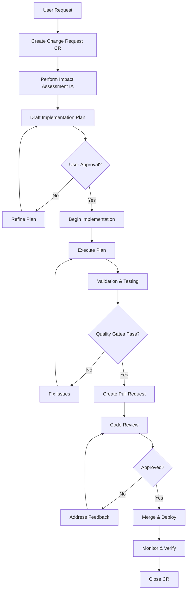

# Change Management Process

> **Version:** 1.0.0  
> **Last Updated:** 2026-02-09  
> **Owner:** Systems Architecture Team

This document defines the formal Change Management Loop that must be followed for all modifications to the system.

---

## Overview

Every change to the system, no matter how small, must go through a structured process to ensure:
- Changes are well-understood before implementation
- Impact is assessed and risks are mitigated
- Documentation stays synchronized with code
- Quality standards are maintained
- Stakeholders are informed

---

## The Change Management Loop



---

## Phase 1: Change Request (CR) Creation

### CR Identification

**CR-ID Format**: `CR-YYYY-MM-DD-XXX`
- `YYYY`: Year
- `MM`: Month (01-12)
- `DD`: Day (01-31)
- `XXX`: Sequential number for that day (001, 002, etc.)

**Example**: `CR-2026-02-09-001`

### CR Document Structure

Create a new file: `/docs/processes/change-requests/CR-[ID].md`

```markdown
# Change Request: CR-YYYY-MM-DD-XXX

**Status**: [DRAFT | PROPOSED | APPROVED | IN_PROGRESS | COMPLETED | REJECTED | CANCELLED]

**Created**: YYYY-MM-DD HH:MM:SS UTC
**Last Updated**: YYYY-MM-DD HH:MM:SS UTC

---

## Basic Information

**Title**: [Brief description of the change]

**Requestor**: [Name/Email of person requesting change]

**Category**: [FEATURE | BUG | REFACTOR | SECURITY | PERFORMANCE | DOCUMENTATION | INFRASTRUCTURE]

**Priority**: 
- [ ] P0 - CRITICAL (System down, security breach)
- [ ] P1 - HIGH (Major feature, significant bug)
- [ ] P2 - MEDIUM (Minor feature, moderate bug)
- [ ] P3 - LOW (Enhancement, minor issue)

**Urgency**:
- [ ] IMMEDIATE (Within 24 hours)
- [ ] HIGH (Within 1 week)
- [ ] NORMAL (Within 2 weeks)
- [ ] LOW (Next sprint/release)

---

## Description

### Problem Statement
[What problem are we solving? What is the current pain point?]

### Proposed Solution
[What is the proposed change? How will it solve the problem?]

### Business Justification
[Why is this change needed? What value does it provide?]

### Alternatives Considered
[What other approaches were considered? Why were they rejected?]

---

## Affected Components

**Systems**:
- [ ] Web Application
- [ ] API Backend
- [ ] Database
- [ ] Message Queue
- [ ] Cache Layer
- [ ] External Integrations
- [ ] CI/CD Pipeline
- [ ] Infrastructure
- [ ] Documentation
- [ ] Other: _______

**Modules/Services**:
- [List specific modules or services affected]

**Files** (Estimated):
- [List key files that will be modified]

---

## Dependencies

**Upstream Dependencies** (must complete before this CR):
- [CR-XXXX: Description]
- [REQ-XXX: Description]

**Downstream Impact** (will affect these):
- [CR-YYYY: Description]
- [Feature Z: Description]

**External Dependencies**:
- [Third-party API update required]
- [Infrastructure changes required]
- [Vendor coordination required]

---

## Stakeholders

**Approver(s)**:
- [Name] - [Role] - [Approval Status]

**Implementer(s)**:
- [Name] - [Role]

**Reviewers**:
- [Name] - [Role]

**Notified Parties**:
- [Team/Person to keep informed]

---

## Approval Status

**Approved by**:
- [ ] Technical Lead: ____________ (Date: ______)
- [ ] Security Team: ____________ (Date: ______) [if security-related]
- [ ] Product Owner: ____________ (Date: ______) [if feature]

**Approval Token Received**: [ATP | Approved to Proceed | Yes/No]
**Approval Date**: YYYY-MM-DD

---

## Implementation Tracking

**Branch**: feat/REQ-XXX-description or fix/Issue-NNN-description
**Pull Request**: #NNN
**Implementation Start**: YYYY-MM-DD
**Implementation End**: YYYY-MM-DD
**Deployed to Production**: YYYY-MM-DD

---

## Change History

| Date | Status | Notes |
|------|--------|-------|
| YYYY-MM-DD | DRAFT | CR created |
| YYYY-MM-DD | PROPOSED | CR submitted for approval |
| YYYY-MM-DD | APPROVED | Approval received |
| YYYY-MM-DD | IN_PROGRESS | Implementation started |
| YYYY-MM-DD | COMPLETED | Change deployed and verified |
```

---

## Phase 2: Impact Assessment (IA)

The Impact Assessment analyzes the "Blast Radius" of the change across multiple dimensions.

### IA Document Template

Include this section in your CR document:

```markdown
## Impact Assessment

**Assessment Date**: YYYY-MM-DD
**Assessed By**: [Name]

---

### 1. Code Impact

**Scope**:
- **Files to Create**: N files
  - [List key files]
- **Files to Modify**: N files
  - [List key files]
- **Files to Delete**: N files
  - [List key files]

**Complexity Estimate**: [Low | Medium | High | Very High]

**Dependencies Affected**:
- [Library/Service X]: [Impact description]
- [Library/Service Y]: [Impact description]

**API Surface Changes**:
- [ ] Public API changes (breaking)
- [ ] Public API changes (non-breaking)
- [ ] Internal API changes
- [ ] No API changes

**Breaking Changes**: [YES | NO]
- If yes, describe: [What will break? How to migrate?]

**Backward Compatibility**: [Maintained | Requires Migration | Breaking]

---

### 2. Security Impact

**Security Assessment**: [LOW | MEDIUM | HIGH | CRITICAL]

**Authentication/Authorization**:
- [ ] No changes to auth
- [ ] Changes to authentication flow
- [ ] Changes to authorization rules
- [ ] New permissions required
- [ ] Service account changes

**Data Exposure**:
- [ ] No new data exposure
- [ ] New PII handling
- [ ] New credentials/secrets
- [ ] New external data access
- [ ] Changes to data encryption

**Secret Management**:
- [ ] No secrets involved
- [ ] Using environment variables
- [ ] Using secret management service
- [ ] Secrets rotation required

**Compliance Requirements**:
- [ ] GDPR considerations
- [ ] SOC2 considerations
- [ ] PCI-DSS considerations
- [ ] HIPAA considerations
- [ ] Other: _______

**Threat Model**:
- [List potential security threats introduced]
- [Mitigation for each threat]

**Security Review Required**: [YES | NO]
**Security Reviewer**: [Name]
**Security Approval**: [PENDING | APPROVED | REJECTED]

---

### 3. Performance Impact

**Performance Assessment**: [POSITIVE | NEUTRAL | NEGATIVE | UNKNOWN]

**Expected Changes**:
- **Latency**: [+/- XX ms or N/A]
- **Throughput**: [+/- XX req/s or N/A]
- **CPU Usage**: [+/- XX% or N/A]
- **Memory Usage**: [+/- XX MB or N/A]
- **Disk I/O**: [+/- XX IOPS or N/A]
- **Network I/O**: [+/- XX MB/s or N/A]

**Scalability Implications**:
- [How does this affect system scalability?]

**Database Impact**:
- [ ] No database changes
- [ ] Schema changes (migrations required)
- [ ] New indexes required
- [ ] Query optimization needed
- [ ] Expected query performance change: [+/- XX%]

**Cache Impact**:
- [ ] No cache changes
- [ ] Cache invalidation required
- [ ] New caching strategy
- [ ] Cache hit rate expected change: [+/- XX%]

**Baseline Metrics**:
- Current P50 latency: XX ms
- Current P95 latency: XX ms
- Current P99 latency: XX ms
- Current throughput: XX req/s
- Current error rate: XX%

**Target Metrics**:
- Target P50 latency: XX ms
- Target P95 latency: XX ms
- Target P99 latency: XX ms
- Target throughput: XX req/s
- Target error rate: XX%

**Performance Testing Required**: [YES | NO]
**Performance Benchmark Results**: [Link to results or N/A]

---

### 4. Testing Impact

**Test Strategy**: [Unit | Integration | E2E | All]

**New Tests Required**:
- **Unit Tests**: N tests
  - [List key test scenarios]
- **Integration Tests**: N tests
  - [List key integration scenarios]
- **E2E Tests**: N tests
  - [List key user flows]

**Existing Tests to Modify**:
- [Test file 1]: [Reason for modification]
- [Test file 2]: [Reason for modification]

**Test Coverage**:
- Current Coverage: XX%
- Expected Coverage After Change: XX%
- New Code Coverage Target: ≥ 80%

**Test Data Requirements**:
- [ ] No new test data needed
- [ ] New fixtures required
- [ ] New mock services required
- [ ] Test environment changes required

**Test Duration Impact**:
- Current Test Suite Duration: XX seconds
- Expected Test Suite Duration: XX seconds

---

### 5. Documentation Impact

**Documentation Updates Required**:

- [ ] README.md
- [ ] API Documentation
- [ ] Architecture Diagrams (Mermaid)
- [ ] Requirement Traceability Matrix (RTM)
- [ ] ADR (Architectural Decision Record)
- [ ] Runbooks
- [ ] User Guide
- [ ] Developer Guide
- [ ] Deployment Guide
- [ ] Troubleshooting Guide
- [ ] FAQ
- [ ] CHANGELOG
- [ ] Other: _______

**Specific Updates**:
- [File: /docs/xxx.md]: [Description of update]
- [File: /docs/yyy.md]: [Description of update]

---

### 6. Operational Impact

**Deployment Requirements**:
- [ ] Standard deployment process
- [ ] Database migration required
- [ ] Configuration changes required
- [ ] Secrets rotation required
- [ ] Infrastructure changes required
- [ ] Blue-green deployment required
- [ ] Canary deployment recommended
- [ ] Maintenance window required

**Rollback Plan**:
[Describe how to rollback this change if issues occur]
- Step 1: [Action]
- Step 2: [Action]
- Time to rollback: [Estimated duration]

**Monitoring & Alerting**:
- [ ] New metrics to monitor
- [ ] New alerts to configure
- [ ] New dashboards to create
- [ ] SLO/SLI changes

**Runbook Updates**:
- [ ] New runbook required
- [ ] Existing runbook to update: [Name]

**Support Impact**:
- [How will this affect support team?]
- [New troubleshooting procedures?]

---

### 7. Risk Assessment

**Overall Risk Level**: [LOW | MEDIUM | HIGH | CRITICAL]

**Identified Risks**:

1. **Risk**: [Description]
   - **Probability**: [Low | Medium | High]
   - **Impact**: [Low | Medium | High]
   - **Mitigation**: [How to mitigate]
   - **Contingency**: [What to do if risk occurs]

2. **Risk**: [Description]
   - **Probability**: [Low | Medium | High]
   - **Impact**: [Low | Medium | High]
   - **Mitigation**: [How to mitigate]
   - **Contingency**: [What to do if risk occurs]

**Risk Matrix**:

| Risk | Probability | Impact | Risk Score | Mitigation |
|------|-------------|--------|------------|------------|
| [Risk 1] | [L/M/H] | [L/M/H] | [Calc] | [Plan] |

**Acceptable Risk Threshold**: [Define acceptable risk level]
**Current Risk Score**: [Calculate based on risks]
**Risk Acceptance**: [ACCEPTED | REQUIRES_MITIGATION | REJECTED]

---

### 8. Blast Radius Summary

**Affected Systems**: [List]
**Affected Users**: [All | Subset | None]
**Affected Teams**: [List]
**Estimated Impact Duration**: [Duration of deployment/migration]
**Reversibility**: [Easy | Moderate | Difficult | Irreversible]

**Blast Radius Size**: [SMALL | MEDIUM | LARGE | CRITICAL]
- SMALL: Single component, easily reversible, low risk
- MEDIUM: Multiple components, reversible with effort, moderate risk
- LARGE: System-wide impact, difficult to reverse, high risk
- CRITICAL: Irreversible or catastrophic impact, very high risk

```

---

## Phase 3: Implementation Plan

Create a detailed, step-by-step plan for implementation.

### Implementation Plan Template

```markdown
## Implementation Plan

**Plan Version**: 1.0
**Created**: YYYY-MM-DD
**Last Updated**: YYYY-MM-DD

---

### Prerequisites

**Before Starting Implementation**:
- [ ] CR approved and ATP token received
- [ ] Branch created: [branch-name]
- [ ] Development environment setup
- [ ] Required tools installed
- [ ] Dependencies updated
- [ ] Test data prepared

---

### Step-by-Step Execution Plan

#### Phase 1: Preparation (TDD Red)

1. **Decompose Requirements**
   - [ ] Break CR into atomic REQ-IDs
   - [ ] Update RTM with new requirements
   - [ ] Link REQ-IDs to CR

2. **Write Failing Tests**
   - [ ] Unit tests for [component X]
   - [ ] Integration tests for [component Y]
   - [ ] E2E tests for [flow Z]
   - [ ] Verify tests fail for right reason

3. **Security Baseline**
   - [ ] Run security scan (current state)
   - [ ] Document baseline vulnerabilities
   - [ ] Run dependency audit

4. **Performance Baseline**
   - [ ] Run performance benchmarks (current state)
   - [ ] Document baseline metrics
   - [ ] Define success criteria

---

#### Phase 2: Implementation (TDD Green)

5. **Core Implementation**
   - [ ] Implement [feature/fix] in [file X]
   - [ ] Implement [feature/fix] in [file Y]
   - [ ] Make unit tests pass
   - [ ] Make integration tests pass

6. **Integration**
   - [ ] Integrate with [component A]
   - [ ] Integrate with [component B]
   - [ ] Make E2E tests pass

7. **Error Handling**
   - [ ] Add error handling for [scenario X]
   - [ ] Add validation for [input Y]
   - [ ] Add fallback for [failure Z]

---

#### Phase 3: Quality (TDD Refactor)

8. **Refactor**
   - [ ] Eliminate duplication
   - [ ] Improve naming and structure
   - [ ] Optimize algorithm if needed
   - [ ] Maintain 100% test pass rate

9. **Observability**
   - [ ] Add structured logging
   - [ ] Add OpenTelemetry tracing
   - [ ] Add metrics/counters
   - [ ] Add health checks

10. **Documentation**
    - [ ] Update inline code comments
    - [ ] Update README if needed
    - [ ] Update API docs if needed
    - [ ] Create/update ADR
    - [ ] Update architecture diagrams
    - [ ] Update RTM with implementation details

---

#### Phase 4: Validation

11. **Testing**
    - [ ] All unit tests pass
    - [ ] All integration tests pass
    - [ ] All E2E tests pass
    - [ ] Coverage ≥ 80%
    - [ ] Manual testing complete

12. **Quality Checks**
    - [ ] Linter passes (zero warnings)
    - [ ] Code formatter passes
    - [ ] Type checker passes (if applicable)
    - [ ] Complexity analysis passes

13. **Security Validation**
    - [ ] Security scan passes (no new vulnerabilities)
    - [ ] Dependency audit clean
    - [ ] No hardcoded secrets
    - [ ] Input validation complete

14. **Performance Validation**
    - [ ] Performance benchmarks run
    - [ ] Meets or exceeds baseline
    - [ ] Within SLO targets
    - [ ] No resource leaks

---

#### Phase 5: Documentation & Review

15. **Final Documentation**
    - [ ] All docs updated and reviewed
    - [ ] Change history updated
    - [ ] Deployment guide ready
    - [ ] Runbook updated

16. **Create Pull Request**
    - [ ] PR created with proper template
    - [ ] PR description complete
    - [ ] CR-ID included in PR title
    - [ ] RTM link in PR
    - [ ] Definition of Done checklist

17. **Code Review**
    - [ ] Reviewers assigned
    - [ ] Feedback addressed
    - [ ] Approval received

---

#### Phase 6: Deployment

18. **Pre-Deployment**
    - [ ] Deployment checklist complete
    - [ ] Rollback plan documented
    - [ ] Stakeholders notified
    - [ ] Monitoring configured

19. **Deployment**
    - [ ] Merge to main
    - [ ] CI/CD pipeline passes
    - [ ] Deploy to staging
    - [ ] Smoke tests pass in staging
    - [ ] Deploy to production

20. **Post-Deployment**
    - [ ] Monitor logs for errors
    - [ ] Verify metrics are nominal
    - [ ] Verify SLOs are met
    - [ ] Stakeholders notified of completion

21. **Close CR**
    - [ ] Update CR status to COMPLETED
    - [ ] Document lessons learned
    - [ ] Archive CR documentation

---

### Estimated Timeline

| Phase | Duration | Start | End |
|-------|----------|-------|-----|
| Preparation | [X hours/days] | [Date] | [Date] |
| Implementation | [X hours/days] | [Date] | [Date] |
| Quality | [X hours/days] | [Date] | [Date] |
| Validation | [X hours/days] | [Date] | [Date] |
| Documentation & Review | [X hours/days] | [Date] | [Date] |
| Deployment | [X hours/days] | [Date] | [Date] |
| **Total** | **[X hours/days]** | [Date] | [Date] |

---

### Files to Modify

| File Path | Type | Change Description | Estimated LOC |
|-----------|------|-------------------|---------------|
| /src/xxx.py | Modify | [Description] | +XX -YY |
| /tests/test_xxx.py | Create | [Description] | +XX |
| /docs/arch/adr/NNNN.md | Create | [Description] | +XX |
| /docs/requirements/rtm.md | Modify | [Description] | +XX -YY |

**Total Estimated Changes**: +XXX -YYY lines across N files

```

---

## Phase 4: Human-in-the-Loop Gate

### Approval Process

**Implementation CANNOT begin until user provides approval token:**

Acceptable approval tokens:
- "Approved to Proceed"
- "ATP"
- "Go Ahead"
- "Implement"
- "LGTM, start implementation"

**Forbidden actions without approval**:
- Creating/modifying code files
- Installing dependencies
- Running database migrations
- Deploying changes
- Making infrastructure changes

**Allowed actions without approval**:
- Reading existing code
- Analyzing architecture
- Researching solutions
- Drafting designs and plans
- Answering clarifying questions
- Running read-only commands

### Feedback Loop

If user provides feedback or requests changes:
1. Update CR document with feedback
2. Revise IA if scope changes
3. Update implementation plan
4. Re-submit for approval
5. Wait for new approval token

---

## Phase 5: Implementation Execution

Follow the implementation plan strictly. Use report_progress tool frequently to:
- Commit incremental changes
- Update CR status
- Keep stakeholders informed
- Track progress against checklist

---

## Phase 6: Validation and Closure

### Pre-Merge Checklist

- [ ] All tests pass
- [ ] Coverage ≥ 80%
- [ ] Linter passes
- [ ] Security scan clean
- [ ] Performance benchmarks pass
- [ ] All documentation updated
- [ ] PR created and approved
- [ ] CI/CD pipeline passes

### Post-Merge Monitoring

Monitor for 24-48 hours after deployment:
- Error rates
- Latency metrics
- Resource utilization
- User feedback

### CR Closure

Update CR document:
- Set status to COMPLETED
- Add final metrics and outcomes
- Document lessons learned
- Archive for future reference

---

## Troubleshooting Common Issues

### Issue: User hasn't provided approval
**Solution**: Wait for explicit approval token. Do not proceed with implementation.

### Issue: Impact assessment reveals high risk
**Solution**: Present findings to user. Consider breaking into smaller CRs or adding additional safeguards.

### Issue: Tests failing during implementation
**Solution**: Fix the code, not the tests (unless requirement changed). Follow TDD golden rule.

### Issue: Security scan fails
**Solution**: Fix vulnerabilities before proceeding. No exceptions for security issues.

### Issue: Documentation drift detected
**Solution**: Update documentation before merging. Docs are code.

---

## Templates and Tools

**Quick Links**:
- CR Template: `/docs/processes/templates/cr-template.md`
- IA Checklist: `/docs/processes/templates/ia-checklist.md`
- Implementation Plan Template: `/docs/processes/templates/impl-plan-template.md`

**Helper Scripts** (to be created):
```bash
# Create new CR
./scripts/create-cr.sh

# Generate IA report
./scripts/generate-ia.sh CR-2026-02-09-001

# Validate governance compliance
./scripts/validate-governance.sh

# Generate PR description
./scripts/generate-pr-description.sh CR-2026-02-09-001
```

---

## Metrics and Continuous Improvement

Track these metrics for each CR:
- Time from request to approval
- Time from approval to implementation
- Time from implementation to deployment
- Number of revision cycles
- Post-deployment issues
- Blast radius accuracy

Review metrics quarterly to improve process.

---

**End of Change Management Process v1.0.0**
