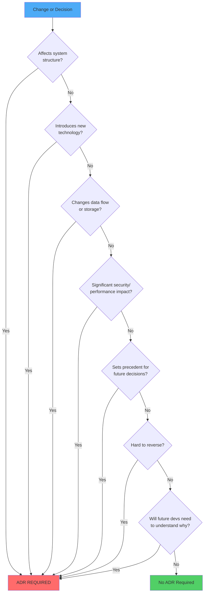

# Decision Tree: Is an Architectural Decision Record (ADR) Required?

> Use this decision tree to determine if your change requires an ADR.

---

## Visual Decision Tree



---

## Decision Questions

### Q1: Does it affect system structure or component boundaries?

**Examples of YES**:
- Adding new microservice or component
- Changing how components communicate
- Splitting or merging components
- Changing deployment architecture

**Examples of NO**:
- Internal refactoring within a component
- Bug fixes
- Adding a helper function

→ **If YES**: ADR REQUIRED  
→ **If NO**: Continue to Q2

---

### Q2: Does it introduce new technology or framework?

**Examples of YES**:
- Adding new database (PostgreSQL, MongoDB, Redis)
- Introducing new framework (FastAPI, Django, React)
- Adding new messaging system (Kafka, RabbitMQ)
- Introducing new language or runtime

**Examples of NO**:
- Using existing technology in new way
- Updating version of existing dependency
- Adding utility library

→ **If YES**: ADR REQUIRED  
→ **If NO**: Continue to Q3

---

### Q3: Does it change data flow or storage patterns?

**Examples of YES**:
- Changing data storage format (CSV → Parquet)
- Introducing caching layer
- Changing database schema significantly
- Modifying data pipeline architecture

**Examples of NO**:
- Adding index to existing table
- Minor schema changes
- Query optimization

→ **If YES**: ADR REQUIRED  
→ **If NO**: Continue to Q4

---

### Q4: Does it have significant security, performance, or reliability impact?

**Examples of YES**:
- Implementing authentication/authorization system
- Changing encryption approach
- Introducing rate limiting or throttling
- Implementing circuit breakers or retry logic

**Examples of NO**:
- Minor performance optimization
- Adding logging
- Small security fix

→ **If YES**: ADR REQUIRED  
→ **If NO**: Continue to Q5

---

### Q5: Does it set a precedent for future decisions?

**Examples of YES**:
- First use of a pattern (e.g., first API endpoint design)
- Establishing coding standards
- Choosing testing strategy
- Defining error handling approach

**Examples of NO**:
- Following existing patterns
- Implementing similar feature to existing ones
- Standard bug fix

→ **If YES**: ADR REQUIRED  
→ **If NO**: Continue to Q6

---

### Q6: Is the decision hard to reverse?

**Examples of YES**:
- Database choice
- Programming language choice
- Cloud provider choice
- Data format with backward compatibility concerns

**Examples of NO**:
- UI framework (can be replaced)
- Logging library (can be swapped)
- Internal algorithm (can be refactored)

→ **If YES**: ADR REQUIRED  
→ **If NO**: Continue to Q7

---

### Q7: Will future developers need to understand why this decision was made?

**Examples of YES**:
- Non-obvious trade-offs were made
- Alternative approaches were considered
- Decision has long-term implications
- Decision affects multiple teams

**Examples of NO**:
- Obvious or standard choice
- Temporary solution
- Isolated change

→ **If YES**: ADR REQUIRED  
→ **If NO**: No ADR Required

---

## Examples with Decisions

### Example 1: Choose Parquet for Log Storage

**Analysis**:
- Q1: Affects system structure? YES (data layer)
- Q2: New technology? YES (Parquet format)
- Q3: Changes data flow/storage? YES (storage format)
- Q4: Significant impact? YES (performance, storage)
- Q5: Sets precedent? YES (data storage pattern)
- Q6: Hard to reverse? YES (data migration required)
- Q7: Future devs need to know why? YES (trade-offs)

**Decision**: ✅ ADR REQUIRED

**ADR Title**: "ADR-0001: Use Apache Parquet for Log Storage"

---

### Example 2: Add Logging to Service

**Analysis**:
- Q1: Affects system structure? NO (internal change)
- Q2: New technology? NO (using existing logging)
- Q3: Changes data flow/storage? NO (observability only)
- Q4: Significant impact? NO (minimal overhead)
- Q5: Sets precedent? NO (following existing pattern)
- Q6: Hard to reverse? NO (easy to change)
- Q7: Future devs need to know why? NO (standard practice)

**Decision**: ❌ No ADR Required

---

### Example 3: Choose FastAPI for REST API

**Analysis**:
- Q1: Affects system structure? YES (API layer)
- Q2: New technology? YES (FastAPI framework)
- Q3: Changes data flow/storage? NO
- Q4: Significant impact? YES (performance, developer experience)
- Q5: Sets precedent? YES (API framework choice)
- Q6: Hard to reverse? YES (rewrite required)
- Q7: Future devs need to know why? YES (alternatives existed)

**Decision**: ✅ ADR REQUIRED

**ADR Title**: "ADR-0002: Use FastAPI for REST API Framework"

---

### Example 4: Refactor Internal Function

**Analysis**:
- Q1: Affects system structure? NO (internal refactor)
- Q2: New technology? NO
- Q3: Changes data flow/storage? NO
- Q4: Significant impact? NO
- Q5: Sets precedent? NO
- Q6: Hard to reverse? NO (easy to refactor again)
- Q7: Future devs need to know why? NO (code is self-explanatory)

**Decision**: ❌ No ADR Required

---

### Example 5: Implement Caching Strategy

**Analysis**:
- Q1: Affects system structure? YES (adds caching layer)
- Q2: New technology? MAYBE (depends on cache implementation)
- Q3: Changes data flow/storage? YES (caching affects data flow)
- Q4: Significant impact? YES (performance, consistency)
- Q5: Sets precedent? YES (caching pattern)
- Q6: Hard to reverse? MAYBE (depends on implementation)
- Q7: Future devs need to know why? YES (cache invalidation strategy)

**Decision**: ✅ ADR REQUIRED

**ADR Title**: "ADR-0003: Implement Redis-based Caching with TTL Strategy"

---

### Example 6: Fix Bug in Parser

**Analysis**:
- Q1: Affects system structure? NO
- Q2: New technology? NO
- Q3: Changes data flow/storage? NO
- Q4: Significant impact? NO (fixes existing behavior)
- Q5: Sets precedent? NO
- Q6: Hard to reverse? NO
- Q7: Future devs need to know why? NO (bug fix is obvious)

**Decision**: ❌ No ADR Required

---

### Example 7: Choose Between SQL and NoSQL

**Analysis**:
- Q1: Affects system structure? YES (data layer)
- Q2: New technology? YES (database choice)
- Q3: Changes data flow/storage? YES (storage mechanism)
- Q4: Significant impact? YES (performance, scalability, consistency)
- Q5: Sets precedent? YES (data storage pattern)
- Q6: Hard to reverse? YES (migration is expensive)
- Q7: Future devs need to know why? YES (trade-offs are significant)

**Decision**: ✅ ADR REQUIRED

**ADR Title**: "ADR-0004: Use PostgreSQL for Relational Data Storage"

---

## Quick Checklist

Use this checklist for quick decision:

- [ ] Affects system structure or component boundaries
- [ ] Introduces new technology or framework
- [ ] Changes data flow or storage patterns
- [ ] Has significant security, performance, or reliability impact
- [ ] Sets precedent for future decisions
- [ ] Is hard to reverse
- [ ] Future developers will need to understand why

**If ANY box is checked → ADR REQUIRED**  
**If ALL boxes are unchecked → No ADR Required**

---

## ADR Template Location

**Template**: `docs/arch/adr-template.md`  
**Location**: `docs/arch/adr/NNNN-title-with-dashes.md`  
**Format**: MADR (Markdown Architectural Decision Records)

---

## ADR Naming Convention

```
docs/arch/adr/
├── 0001-log-ingestion-tech-stack.md
├── 0002-use-parquet-for-storage.md
├── 0003-implement-redis-caching.md
└── 0004-choose-postgresql-database.md
```

**Format**: `NNNN-title-with-dashes.md`
- `NNNN`: Sequential number (0001, 0002, etc.)
- `title-with-dashes`: Brief, descriptive title

---

## When in Doubt

**If you're unsure whether an ADR is required:**

1. **Err on the side of creating one**: ADRs are lightweight
2. **Ask yourself**: "Will I remember why I made this choice in 6 months?"
3. **Consider**: "Will new team members wonder why we did this?"
4. **Check**: Does this decision affect multiple people or teams?

**Remember**: It's better to have an unnecessary ADR than to lack documentation for an important decision.

---

## ADR Status Values

- **PROPOSED**: Decision is being considered
- **ACCEPTED**: Decision has been made and is active
- **DEPRECATED**: Decision is no longer recommended but still in use
- **SUPERSEDED**: Decision has been replaced by a newer ADR

---

## Related Documentation

- **ADR Template**: `docs/arch/adr-template.md`
- **Existing ADRs**: `docs/arch/adr/`
- **Governance Framework**: `.github/copilot-instructions.md`
- **Change Management**: `docs/processes/change-management.md`

---

**Last Updated**: 2026-02-19
