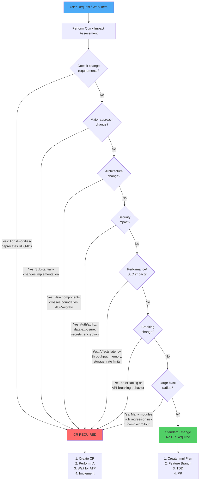

# Decision Tree: Is a Change Request (CR) Required?

> Use this decision tree to determine if your change requires a formal CR with Impact Assessment and ATP gate.

---

## Visual Decision Tree

---

## Text-Based Decision Process

### Step 1: Perform Quick Impact Assessment (QIA)

Answer these questions:

**Q1: Does it change requirements?**
- Adds new REQ-IDs to RTM?
- Modifies existing REQ-IDs?
- Deprecates existing REQ-IDs?

→ **If YES to any**: CR REQUIRED  
→ **If NO to all**: Continue to Q2

---

**Q2: Is it a major approach change?**
- Substantially changes how an existing requirement is implemented?
- Changes workflow, data model, or integration contract?
- Affects how the system achieves its goals?

→ **If YES**: CR REQUIRED  
→ **If NO**: Continue to Q3

---

**Q3: Is it an architecture change?**
- Introduces new components or services?
- Crosses component boundaries?
- Changes how components interact?
- Worthy of an ADR (Architectural Decision Record)?

→ **If YES**: CR REQUIRED  
→ **If NO**: Continue to Q4

---

**Q4: Does it have security impact?**
- Changes authentication or authorization?
- Affects data exposure or PII handling?
- Involves secrets, credentials, or encryption?
- Impacts compliance (GDPR, SOC2, PCI-DSS, HIPAA)?

→ **If YES**: CR REQUIRED  
→ **If NO**: Continue to Q5

---

**Q5: Does it impact performance or SLOs?**
- Affects latency (P50, P95, P99)?
- Changes throughput capacity?
- Impacts memory or CPU usage?
- Affects storage growth or rate limits?
- Could violate SLO targets?

→ **If YES**: CR REQUIRED  
→ **If NO**: Continue to Q6

---

**Q6: Is it a breaking change?**
- Changes user-facing behavior in incompatible way?
- Breaks API contracts?
- Requires users to change their code?
- Removes or renames public interfaces?

→ **If YES**: CR REQUIRED  
→ **If NO**: Continue to Q7

---

**Q7: Does it have large blast radius?**
- Touches many modules or files?
- High regression risk?
- Complex rollout or rollback?
- Requires coordination across teams?

→ **If YES**: CR REQUIRED  
→ **If NO**: Standard Change (No CR)

---

## Examples with Decisions

### Example 1: Bug Fix

**Scenario**: Fix incorrect timestamp parsing in log parser

**Analysis**:
- Q1: Changes requirements? NO (fixes existing REQ-005)
- Q2: Major approach change? NO (same parsing logic, corrected)
- Q3: Architecture change? NO (same component)
- Q4: Security impact? NO
- Q5: Performance/SLO impact? NO (same performance)
- Q6: Breaking change? NO (fixes bug)
- Q7: Large blast radius? NO (single file)

**Decision**: ✅ Standard Change (No CR)

---

### Example 2: Add Structured Logging

**Scenario**: Add JSON-formatted structured logging to service

**Analysis**:
- Q1: Changes requirements? NO (adds observability, doesn't change functional REQs)
- Q2: Major approach change? NO (additive)
- Q3: Architecture change? NO (same components)
- Q4: Security impact? NO (logging only, no sensitive data)
- Q5: Performance/SLO impact? NO (minimal overhead)
- Q6: Breaking change? NO (internal change)
- Q7: Large blast radius? NO (low risk)

**Decision**: ✅ Standard Change (No CR)

---

### Example 3: Change Storage Format (CSV → Parquet)

**Scenario**: Replace CSV storage with Parquet format

**Analysis**:
- Q1: Changes requirements? YES (modifies REQ-008 storage format)
- Q2: Major approach change? YES (different storage mechanism)
- Q3: Architecture change? YES (affects data layer)
- Q4: Security impact? MAYBE (data format change)
- Q5: Performance/SLO impact? YES (different I/O characteristics)
- Q6: Breaking change? YES (incompatible format)
- Q7: Large blast radius? YES (affects multiple components)

**Decision**: ❌ CR REQUIRED (multiple triggers)

---

### Example 4: Add New API Endpoint

**Scenario**: Add new GET /logs/summary endpoint

**Analysis**:
- Q1: Changes requirements? YES (new REQ-XXX for summary endpoint)
- Q2: Major approach change? NO (additive)
- Q3: Architecture change? NO (uses existing components)
- Q4: Security impact? MAYBE (new data exposure)
- Q5: Performance/SLO impact? MAYBE (new query load)
- Q6: Breaking change? NO (additive)
- Q7: Large blast radius? NO (isolated feature)

**Decision**: ❌ CR REQUIRED (new requirement + potential security/performance impact)

---

### Example 5: Refactor Internal Function

**Scenario**: Refactor parse_log() to improve readability

**Analysis**:
- Q1: Changes requirements? NO (same behavior)
- Q2: Major approach change? NO (same algorithm, cleaner code)
- Q3: Architecture change? NO (internal refactor)
- Q4: Security impact? NO
- Q5: Performance/SLO impact? NO (same performance)
- Q6: Breaking change? NO (internal function)
- Q7: Large blast radius? NO (single function)

**Decision**: ✅ Standard Change (No CR)

---

### Example 6: Update Dependency Version

**Scenario**: Update requests library from 2.28.0 to 2.31.0

**Analysis**:
- Q1: Changes requirements? NO
- Q2: Major approach change? NO
- Q3: Architecture change? NO
- Q4: Security impact? MAYBE (security patches)
- Q5: Performance/SLO impact? MAYBE (performance changes)
- Q6: Breaking change? MAYBE (API changes)
- Q7: Large blast radius? MAYBE (used throughout)

**Decision**: Depends on change notes:
- **Patch version (2.28.0 → 2.28.1)**: ✅ Standard Change
- **Minor version (2.28.0 → 2.29.0)**: ✅ Standard Change (if no breaking changes)
- **Major version (2.28.0 → 3.0.0)**: ❌ CR REQUIRED (likely breaking changes)

---

## Quick Reference Checklist

Use this checklist for quick decision:

- [ ] Requirements change (adds/modifies/deprecates REQ-IDs)
- [ ] Major approach change (substantially changes implementation)
- [ ] Architecture change (new components, crosses boundaries, ADR-worthy)
- [ ] Security impact (auth/authz, data exposure, secrets, encryption, compliance)
- [ ] Performance/SLO impact (latency, throughput, memory, storage, rate limits)
- [ ] Breaking change (user-facing or API-breaking)
- [ ] Large blast radius (many modules, high regression risk, complex rollout)

**If ANY box is checked → CR REQUIRED**  
**If ALL boxes are unchecked → Standard Change (No CR)**

---

## When in Doubt

**If you're unsure whether a CR is required:**

1. **Err on the side of caution**: Create a CR
2. **Ask in the QIA**: Document your uncertainty
3. **Consult the team**: Discuss in code review or team chat
4. **Check similar past changes**: Look at previous CRs for patterns

**Remember**: It's better to create an unnecessary CR than to skip a necessary one.

---

## Related Documentation

- **Change Management Process**: `docs/processes/change-management.md`
- **QIA Template**: `.kiro/steering/change-management.md`
- **CR Template**: `docs/processes/templates/cr-template.md`
- **Governance Framework**: `.github/copilot-instructions.md`

---

**Last Updated**: 2026-02-19
