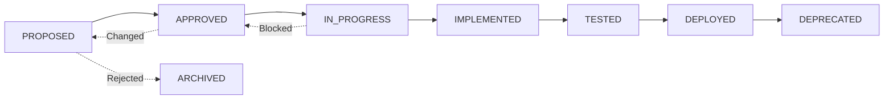

# Requirement Traceability Matrix (RTM)

> **Version:** 1.1.0  
> **Last Updated:** 2026-02-10  
> **Status:** ACTIVE

This document is the **single source of truth** for all system requirements. Every feature, function, and capability must trace back to a requirement defined in this matrix.

---

## Requirement Format

**REQ-ID**: `REQ-NNN` (sequential numbering, zero-padded to 3 digits)

**Category Prefixes**:
- `[FUNC]` - Functional requirement
- `[NFR-PERF]` - Non-functional: Performance
- `[NFR-SEC]` - Non-functional: Security
- `[NFR-REL]` - Non-functional: Reliability
- `[NFR-SCALE]` - Non-functional: Scalability
- `[NFR-MAINT]` - Non-functional: Maintainability
- `[NFR-OBS]` - Non-functional: Observability

**Status Values**:
- `PROPOSED` - Requirement identified but not yet approved
- `APPROVED` - Requirement approved for implementation
- `IN_PROGRESS` - Currently being implemented
- `IMPLEMENTED` - Code written and committed
- `TESTED` - Tests written and passing
- `DEPLOYED` - Available in production
- `DEPRECATED` - No longer applicable

---

## Requirements Matrix

| REQ-ID | Category | Description | Status | Priority | Implemented In | Test Coverage | ADR Link | Date Added |
|--------|----------|-------------|--------|----------|----------------|---------------|----------|------------|
| REQ-001 | [FUNC] | Example: System shall parse log files | PROPOSED | P2 | - | - | - | 2026-02-09 |
| REQ-002 | [NFR-PERF] | Example: Parsing shall complete < 100ms for files < 1MB | PROPOSED | P2 | - | - | - | 2026-02-09 |
| REQ-003 | [NFR-SEC] | Example: Input paths validated for directory traversal | PROPOSED | P1 | - | - | - | 2026-02-09 |
| REQ-004 | [FUNC] | Service shall authenticate with Rapid7 InsightOps API | APPROVED | P1 | - | - | ADR-0001 | 2026-02-10 |
| REQ-005 | [FUNC] | Service shall fetch logs via API with configurable endpoints | APPROVED | P1 | - | - | ADR-0001 | 2026-02-10 |
| REQ-006 | [FUNC] | Service shall parse CSV-formatted log structure dynamically | APPROVED | P1 | - | - | ADR-0001 | 2026-02-10 |
| REQ-007 | [FUNC] | Service shall write logs to Apache Parquet format | APPROVED | P1 | - | - | ADR-0001 | 2026-02-10 |
| REQ-008 | [FUNC] | Service shall support configuration via environment variables | APPROVED | P2 | - | - | ADR-0001 | 2026-02-10 |
| REQ-009 | [NFR-SEC] | API credentials shall be stored in environment variables only | APPROVED | P0 | - | - | ADR-0001 | 2026-02-10 |
| REQ-010 | [NFR-OBS] | Service shall emit structured JSON logs with trace context | APPROVED | P2 | - | - | ADR-0001 | 2026-02-10 |
| REQ-011 | [NFR-PERF] | Service shall process logs efficiently using batching | APPROVED | P2 | - | - | ADR-0001 | 2026-02-10 |

---

## Requirements by Category

### Functional Requirements (FUNC)

| REQ-ID | Description | Status | Implementation |
|--------|-------------|--------|----------------|
| REQ-001 | Example functional requirement | PROPOSED | - |

### Non-Functional Requirements (NFR)

#### Performance (NFR-PERF)

| REQ-ID | Description | Target Metric | Status |
|--------|-------------|---------------|--------|
| REQ-002 | Example performance requirement | < 100ms | PROPOSED |

#### Security (NFR-SEC)

| REQ-ID | Description | Status | Implementation |
|--------|-------------|--------|----------------|
| REQ-003 | Example security requirement | PROPOSED | - |

#### Reliability (NFR-REL)

| REQ-ID | Description | Target Metric | Status |
|--------|-------------|---------------|--------|
| - | No requirements defined yet | - | - |

#### Scalability (NFR-SCALE)

| REQ-ID | Description | Target Metric | Status |
|--------|-------------|---------------|--------|
| - | No requirements defined yet | - | - |

#### Maintainability (NFR-MAINT)

| REQ-ID | Description | Status | Implementation |
|--------|-------------|--------|----------------|
| - | No requirements defined yet | - | - |

#### Observability (NFR-OBS)

| REQ-ID | Description | Status | Implementation |
|--------|-------------|--------|----------------|
| - | No requirements defined yet | - | - |

---

## Requirement Details

### REQ-001: Example Functional Requirement
**Category**: [FUNC]  
**Priority**: P2  
**Status**: PROPOSED  
**Date Added**: 2026-02-09

**Description**:  
System shall parse log files in various standard formats (Apache Common Log Format, NGINX, etc.)

**Acceptance Criteria**:
- [ ] Parser correctly identifies log format
- [ ] Parser extracts all relevant fields
- [ ] Parser handles malformed entries gracefully
- [ ] Parser performance meets NFR-PERF requirements

**Related Requirements**:
- REQ-002 (Performance constraint)
- REQ-003 (Security constraint)

**Implemented In**:
- File: TBD
- Function/Class: TBD

**Test Coverage**:
- Test File: TBD
- Test Cases: TBD
- Coverage: TBD%

**ADR Link**: TBD

---

### REQ-002: Example Performance Requirement
**Category**: [NFR-PERF]  
**Priority**: P2  
**Status**: PROPOSED  
**Date Added**: 2026-02-09

**Description**:  
Log file parsing shall complete within 100 milliseconds for files under 1MB in size.

**Measurement**:
- Metric: P95 latency
- Tool: Performance benchmarks in test suite
- Baseline: TBD
- Target: < 100ms

**Related Requirements**:
- REQ-001 (Functional requirement this constrains)

**SLO Reference**: `/docs/requirements/slos.md#parsing-performance`

---

### REQ-003: Example Security Requirement
**Category**: [NFR-SEC]  
**Priority**: P1  
**Status**: PROPOSED  
**Date Added**: 2026-02-09

**Description**:  
All file path inputs must be validated to prevent directory traversal attacks.

**Security Controls**:
- [ ] Path canonicalization
- [ ] Allowlist validation
- [ ] Deny list for dangerous patterns (../, etc.)
- [ ] Logging of validation failures

**Related Requirements**:
- REQ-001 (Functional requirement this secures)

**Threat Model**: TBD  
**Mitigation**: TBD

---

### REQ-004: Rapid7 API Authentication
**Category**: [FUNC]  
**Priority**: P1  
**Status**: APPROVED  
**Date Added**: 2026-02-10

**Description**:  
Service shall authenticate with the Rapid7 InsightOps API using API key authentication. The service must construct proper authentication headers and handle authentication failures gracefully.

**Acceptance Criteria**:
- [ ] API client constructs correct Authorization header format
- [ ] API client includes API key from environment variable
- [ ] Service handles 401 Unauthorized responses appropriately
- [ ] Service handles 403 Forbidden responses appropriately
- [ ] Authentication failures are logged with appropriate error details
- [ ] No API keys hardcoded in source code

**Related Requirements**:
- REQ-009 (Security requirement for credential storage)
- REQ-005 (Functional requirement for API access)

**Implemented In**:
- File: `/src/log_ingestion/api_client.py`
- Class: `Rapid7ApiClient.__init__()`, `Rapid7ApiClient.fetch_logs()`

**Test Coverage**:
- Test File: `/tests/test_api_client.py`
- Test Cases: 
  - `test_api_client_constructs_auth_header()`
  - `test_api_client_handles_401_unauthorized()`
  - `test_api_client_handles_403_forbidden()`
- Coverage: TBD%

**ADR Link**: [ADR-0001](/docs/arch/adr/0001-log-ingestion-tech-stack.md)

---

### REQ-005: Fetch Logs via API
**Category**: [FUNC]  
**Priority**: P1  
**Status**: APPROVED  
**Date Added**: 2026-02-10

**Description**:  
Service shall fetch logs from the Rapid7 InsightOps API with configurable endpoints. The service must support pagination, handle API errors, and implement retry logic with exponential backoff for transient failures.

**Acceptance Criteria**:
- [ ] Service successfully fetches logs from API
- [ ] API endpoint is configurable via environment variable
- [ ] Service handles pagination if API returns paged results
- [ ] Service implements retry logic for transient failures (5xx errors, timeouts)
- [ ] Service implements exponential backoff between retries
- [ ] Service respects API rate limits (429 responses)
- [ ] Service handles network connectivity errors gracefully
- [ ] All API requests are logged with request/response details

**Parameters**:
- `start_time`: Start of time range for logs (ISO 8601 format)
- `end_time`: End of time range for logs (ISO 8601 format)
- `batch_size`: Number of log entries to fetch per request (configurable)

**Related Requirements**:
- REQ-004 (Authentication dependency)
- REQ-011 (Performance requirement for efficiency)

**Implemented In**:
- File: `/src/log_ingestion/api_client.py`
- Class: `Rapid7ApiClient`
- Method: `fetch_logs(start_time, end_time)`

**Test Coverage**:
- Test File: `/tests/test_api_client.py`
- Test Cases:
  - `test_api_client_fetches_logs_successfully()`
  - `test_api_client_handles_429_rate_limit()`
  - `test_api_client_handles_500_server_error()`
  - `test_api_client_timeout_handling()`
  - `test_api_client_respects_rate_limiting()`
- Coverage: TBD%

**ADR Link**: [ADR-0001](/docs/arch/adr/0001-log-ingestion-tech-stack.md)

---

### REQ-006: Dynamic CSV Schema Detection
**Category**: [FUNC]  
**Priority**: P1  
**Status**: APPROVED  
**Date Added**: 2026-02-10

**Description**:  
Service shall parse CSV-formatted log data with dynamic schema detection. The schema can be provided in two ways: as CSV headers in the first row, or as a separate schema definition provided at runtime. The parser must infer data types automatically and handle malformed data gracefully.

**Acceptance Criteria**:
- [ ] Parser detects schema from CSV headers (first row)
- [ ] Parser accepts schema definition provided at runtime
- [ ] Parser infers data types (string, integer, float, timestamp, boolean)
- [ ] Parser handles missing values appropriately
- [ ] Parser handles malformed CSV data gracefully (logs errors, continues processing)
- [ ] Parser handles special characters and quoted fields correctly
- [ ] Parser validates data against detected schema
- [ ] Schema is cached for reuse across batches

**Supported Data Types**:
- String (default)
- Integer (int64)
- Float (float64)
- Timestamp (datetime64[ns])
- Boolean (bool)

**Related Requirements**:
- REQ-007 (Parquet writer depends on parsed schema)
- REQ-010 (Observability requirement for parse errors)

**Implemented In**:
- File: `/src/log_ingestion/parser.py`
- Class: `LogParser`
- Methods: `detect_schema()`, `parse()`

**Test Coverage**:
- Test File: `/tests/test_parser.py`
- Test Cases:
  - `test_parser_detects_schema_from_headers()`
  - `test_parser_detects_schema_from_first_row()`
  - `test_parser_parses_data_correctly()`
  - `test_parser_handles_malformed_csv()`
  - `test_parser_handles_empty_data()`
  - `test_parser_infers_data_types()`
- Coverage: TBD%

**ADR Link**: [ADR-0001](/docs/arch/adr/0001-log-ingestion-tech-stack.md)

---

### REQ-007: Parquet File Writing
**Category**: [FUNC]  
**Priority**: P1  
**Status**: APPROVED  
**Date Added**: 2026-02-10

**Description**:  
Service shall write parsed log data to Apache Parquet files with compression. Files shall be partitioned by date/time for efficient querying. The Parquet writer must validate files after writing to ensure data integrity.

**Acceptance Criteria**:
- [ ] Writer creates valid Apache Parquet files
- [ ] Writer applies compression (Snappy by default, configurable)
- [ ] Writer partitions files by date (e.g., `/data/logs/2026/02/10/logs_hour.parquet`)
- [ ] Writer supports batch writing for efficiency
- [ ] Writer validates written files are readable
- [ ] Writer reports compression ratio
- [ ] Files can be read by standard Parquet tools (Pandas, Spark, DuckDB)
- [ ] Schema is preserved in Parquet metadata

**Output Format**:
- File naming: `logs_{date}_{hour}.parquet`
- Partitioning: `YYYY/MM/DD/`
- Compression: Snappy (default), GZIP, Brotli (configurable)
- Schema: Preserved from parsed data

**Performance Targets**:
- Write speed: > 5,000 entries/second
- Compression ratio: > 70% vs raw JSON
- File validation: < 100ms per file

**Related Requirements**:
- REQ-006 (Parser provides data to write)
- REQ-011 (Performance requirement for efficiency)

**Implemented In**:
- File: `/src/log_ingestion/parquet_writer.py`
- Class: `ParquetWriter`
- Methods: `write(dataframe, partition_date)`

**Test Coverage**:
- Test File: `/tests/test_parquet_writer.py`
- Test Cases:
  - `test_writer_creates_parquet_schema()`
  - `test_writer_writes_single_batch()`
  - `test_writer_writes_multiple_batches()`
  - `test_writer_partitions_by_date()`
  - `test_writer_applies_compression()`
  - `test_writer_validates_output_file()`
- Coverage: TBD%

**ADR Link**: [ADR-0001](/docs/arch/adr/0001-log-ingestion-tech-stack.md)

---

### REQ-008: Configuration Management
**Category**: [FUNC]  
**Priority**: P2  
**Status**: APPROVED  
**Date Added**: 2026-02-10

**Description**:  
Service shall support configuration via environment variables following the 12-factor app methodology. Configuration must include validation with clear error messages for misconfiguration. Both required and optional parameters with sensible defaults shall be supported.

**Acceptance Criteria**:
- [ ] All required configuration parameters are loaded from environment variables
- [ ] Optional parameters have documented default values
- [ ] Configuration validation occurs at startup
- [ ] Validation errors include clear, actionable error messages
- [ ] Configuration can be loaded from `.env` file (development)
- [ ] Configuration can be loaded from system environment (production)
- [ ] Configuration object is type-safe (Pydantic models)
- [ ] IDE autocomplete works for configuration fields

**Required Configuration**:
- `RAPID7_API_KEY`: API authentication key
- `RAPID7_API_ENDPOINT`: Base API URL
- `OUTPUT_DIR`: Directory for Parquet files

**Optional Configuration** (with defaults):
- `LOG_LEVEL`: `INFO` (DEBUG, INFO, WARNING, ERROR)
- `BATCH_SIZE`: `1000` (100-10000)
- `RATE_LIMIT`: `60` (requests per minute)
- `RETRY_ATTEMPTS`: `3` (1-10)
- `PARQUET_COMPRESSION`: `snappy` (snappy, gzip, brotli, none)

**Related Requirements**:
- REQ-009 (Security requirement for credential handling)

**Implemented In**:
- File: `/src/log_ingestion/config.py`
- Class: `LogIngestionConfig`

**Test Coverage**:
- Test File: `/tests/test_config.py`
- Test Cases:
  - `test_config_loads_from_environment()`
  - `test_config_validates_required_fields()`
  - `test_config_uses_default_values()`
  - `test_config_validates_api_endpoint_format()`
  - `test_config_validates_output_dir_exists()`
- Coverage: TBD%

**ADR Link**: [ADR-0001](/docs/arch/adr/0001-log-ingestion-tech-stack.md)

---

### REQ-009: Secure Credential Storage
**Category**: [NFR-SEC]  
**Priority**: P0 (CRITICAL)  
**Status**: APPROVED  
**Date Added**: 2026-02-10

**Description**:  
API credentials and other secrets shall NEVER be hardcoded in source code. All credentials must be stored in environment variables or a secure secret management system. The `.env` file containing credentials must be excluded from version control.

**Acceptance Criteria**:
- [ ] No API keys or credentials in source code
- [ ] No API keys or credentials in configuration files committed to git
- [ ] `.env` file is excluded via `.gitignore`
- [ ] `.env.example` template provided (with no real secrets)
- [ ] Credentials loaded from environment variables at runtime
- [ ] Credentials not logged or exposed in error messages
- [ ] File permissions on `.env` are restrictive (600 or 400)
- [ ] Security scan passes with zero hardcoded secrets

**Security Controls**:
- [x] Environment variable storage for all secrets
- [x] `.gitignore` includes `.env`
- [x] Code review checklist includes secret scanning
- [ ] Automated secret detection in CI/CD (git-secrets, bandit)
- [ ] Credential rotation procedure documented

**Threat Model**:
- **Threat**: Credentials committed to git repository
  - **Mitigation**: `.gitignore`, pre-commit hooks, code review
- **Threat**: Credentials exposed in logs
  - **Mitigation**: Sanitize all log output, never log credential values
- **Threat**: Credentials in error messages
  - **Mitigation**: Generic error messages, credential redaction

**Related Requirements**:
- REQ-004 (Functional requirement for API authentication)
- REQ-008 (Functional requirement for configuration)

**Implemented In**:
- File: All source files
- Enforcement: Code review, security scanning, CI/CD checks

**Test Coverage**:
- Test File: Security audit, bandit scan
- Test Cases: Automated secret detection
- Coverage: 100% (all files scanned)

**ADR Link**: [ADR-0001](/docs/arch/adr/0001-log-ingestion-tech-stack.md)

**Compliance**: GDPR, SOC2, PCI-DSS

---

### REQ-010: Structured Logging with Trace Context
**Category**: [NFR-OBS]  
**Priority**: P2  
**Status**: APPROVED  
**Date Added**: 2026-02-10

**Description**:  
Service shall emit structured JSON logs with trace context for observability. All log events must include standard fields (timestamp, level, service, version) and context fields (trace_id, request_id) for correlation. Logs should be parseable by standard log aggregation systems.

**Acceptance Criteria**:
- [ ] All logs emitted in JSON format
- [ ] Standard fields present in all logs (timestamp, level, event, service, version)
- [ ] Trace context included (trace_id for request correlation)
- [ ] Log levels used appropriately (DEBUG, INFO, WARNING, ERROR)
- [ ] Structured fields for important data (not just message strings)
- [ ] No sensitive data (credentials, PII) in logs
- [ ] Logs written to stdout (container-friendly)
- [ ] Log format compatible with ELK, Splunk, CloudWatch

**Standard Log Fields**:
```json
{
  "timestamp": "2026-02-10T10:00:00Z",
  "level": "INFO",
  "service": "log-ingestion",
  "version": "0.1.0",
  "environment": "production",
  "trace_id": "abc123",
  "event": "event_name",
  "context": {...}
}
```

**Key Log Events**:
- `service_started`, `config_loaded`, `api_request`, `api_response`
- `logs_fetched`, `parse_start`, `parse_complete`
- `file_write_start`, `file_write_complete`
- `batch_complete`, `error`

**Related Requirements**:
- REQ-009 (Security requirement - no credentials in logs)

**Implemented In**:
- File: All source files
- Library: `structlog`
- Configuration: `/src/log_ingestion/main.py`

**Test Coverage**:
- Test File: `/tests/test_main.py`, integration tests
- Test Cases: Verify log output format and content
- Coverage: TBD%

**ADR Link**: [ADR-0001](/docs/arch/adr/0001-log-ingestion-tech-stack.md)

**Monitoring**: Logs ingested into ELK/Splunk for alerting

---

### REQ-011: Efficient Batch Processing
**Category**: [NFR-PERF]  
**Priority**: P2  
**Status**: APPROVED  
**Date Added**: 2026-02-10

**Description**:  
Service shall process logs efficiently using batching to achieve target throughput of 1,000-10,000 log entries per minute. Memory usage must remain under 500 MB under normal load. Batch size must be configurable to balance memory usage and throughput.

**Acceptance Criteria**:
- [ ] Throughput: Process 1,000-10,000 entries per minute
- [ ] Memory: Peak memory usage < 500 MB under normal load
- [ ] Batch size configurable via environment variable
- [ ] Efficient CSV parsing (leverage pandas chunking)
- [ ] Efficient Parquet writing (use PyArrow batch writing)
- [ ] No memory leaks under sustained operation
- [ ] Resource usage scales linearly with batch size

**Performance Targets**:
- Parse rate: > 10,000 entries/second
- Write rate: > 5,000 entries/second
- API call latency: < 5 seconds (P95)
- End-to-end latency: < 100ms per 1000 entries
- Memory per batch: < 50 MB

**Measurement**:
- Tool: Performance benchmarks in test suite
- Metrics: Throughput, latency, memory usage
- Profiling: Memory profiling for leak detection

**Related Requirements**:
- REQ-005 (Functional requirement for API fetching)
- REQ-006 (Functional requirement for parsing)
- REQ-007 (Functional requirement for writing)

**Implemented In**:
- File: `/src/log_ingestion/main.py` (orchestration)
- File: `/src/log_ingestion/parser.py` (batch parsing)
- File: `/src/log_ingestion/parquet_writer.py` (batch writing)

**Test Coverage**:
- Test File: `/tests/benchmark.py`
- Test Cases: Performance benchmarks
- Coverage: TBD%

**ADR Link**: [ADR-0001](/docs/arch/adr/0001-log-ingestion-tech-stack.md)

**SLO Reference**: `/docs/requirements/slos.md#log-ingestion-performance`

---

## Traceability Views

### By Status

#### PROPOSED
- REQ-001, REQ-002, REQ-003

#### APPROVED
- REQ-004, REQ-005, REQ-006, REQ-007, REQ-008, REQ-009, REQ-010, REQ-011

#### IN_PROGRESS
- (None yet)

#### IMPLEMENTED
- (None yet)

#### TESTED
- (None yet)

#### DEPLOYED
- (None yet)

#### DEPRECATED
- (None yet)

---

### By Priority

#### P0 - CRITICAL
- REQ-009

#### P1 - HIGH
- REQ-003, REQ-004, REQ-005, REQ-006, REQ-007

#### P2 - MEDIUM
- REQ-001, REQ-002, REQ-008, REQ-010, REQ-011

#### P3 - LOW
- (None yet)

---

## Change History

| Date | REQ-IDs | Change Description | Changed By | CR Reference |
|------|---------|-------------------|------------|--------------|
| 2026-02-09 | REQ-001, REQ-002, REQ-003 | Initial example requirements | System | - |
| 2026-02-10 | REQ-004, REQ-005, REQ-006, REQ-007, REQ-008, REQ-009, REQ-010, REQ-011 | Log ingestion service requirements | Development Team | CR-2026-02-10-001 |

---

## Guidelines for Updating RTM

### When to Add Requirements

1. **New Feature Request**: Break down into atomic requirements
2. **Bug Discovery**: If bug reveals missing requirement, add it
3. **NFR Identification**: When performance/security/reliability needs are defined
4. **Architectural Change**: When structure changes necessitate new requirements

### How to Add Requirements

1. Assign next available REQ-ID (sequential)
2. Choose appropriate category
3. Write clear, testable description
4. Set priority (P0-P3)
5. Set initial status (usually PROPOSED)
6. Add to main matrix table
7. Create detailed section below
8. Update change history

### How to Update Requirements

1. Change status as work progresses
2. Add implementation details when code is written
3. Add test coverage information when tests are written
4. Link to ADRs when architectural decisions are made
5. Update change history with each modification

### Requirement Lifecycle



---

## Validation Checklist

Before considering a requirement "complete", verify:

- [ ] REQ-ID is unique and sequential
- [ ] Category is correct
- [ ] Description is clear and testable
- [ ] Priority is assigned
- [ ] Status is current
- [ ] Implementation location is documented (when applicable)
- [ ] Test coverage is documented (when applicable)
- [ ] Related requirements are linked
- [ ] ADR is linked (if architectural decision made)
- [ ] Change history is updated

---

## Metrics and Reports

### Coverage Statistics

- **Total Requirements**: 11
- **Implemented**: 0 (0%)
- **Tested**: 0 (0%)
- **Deployed**: 0 (0%)
- **Approved**: 8 (73%)

### By Category

- **Functional**: 6 (55%)
- **Performance**: 2 (18%)
- **Security**: 2 (18%)
- **Observability**: 1 (9%)
- **Reliability**: 0 (0%)
- **Scalability**: 0 (0%)
- **Maintainability**: 0 (0%)

### By Priority

- **P0 (Critical)**: 1 (9%)
- **P1 (High)**: 5 (45%)
- **P2 (Medium)**: 5 (45%)
- **P3 (Low)**: 0 (0%)

---

**End of Requirement Traceability Matrix v1.1.0**
