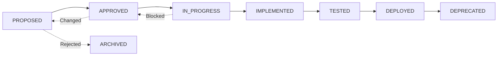

# Requirement Traceability Matrix (RTM)

> **Version:** 1.0.0  
> **Last Updated:** 2026-02-09  
> **Status:** ACTIVE

This document is the **single source of truth** for all system requirements. Every feature, function, and capability must trace back to a requirement defined in this matrix.

---

## Requirement Format

**REQ-ID**: `REQ-NNN` (sequential numbering, zero-padded to 3 digits)

**Category Prefixes**:
- `[FUNC]` - Functional requirement
- `[NFR-PERF]` - Non-functional: Performance
- `[NFR-SEC]` - Non-functional: Security
- `[NFR-REL]` - Non-functional: Reliability
- `[NFR-SCALE]` - Non-functional: Scalability
- `[NFR-MAINT]` - Non-functional: Maintainability
- `[NFR-OBS]` - Non-functional: Observability

**Status Values**:
- `PROPOSED` - Requirement identified but not yet approved
- `APPROVED` - Requirement approved for implementation
- `IN_PROGRESS` - Currently being implemented
- `IMPLEMENTED` - Code written and committed
- `TESTED` - Tests written and passing
- `DEPLOYED` - Available in production
- `DEPRECATED` - No longer applicable

---

## Requirements Matrix

| REQ-ID | Category | Description | Status | Priority | Implemented In | Test Coverage | ADR Link | Date Added |
|--------|----------|-------------|--------|----------|----------------|---------------|----------|------------|
| REQ-001 | [FUNC] | Example: System shall parse log files | PROPOSED | P2 | - | - | - | 2026-02-09 |
| REQ-002 | [NFR-PERF] | Example: Parsing shall complete < 100ms for files < 1MB | PROPOSED | P2 | - | - | - | 2026-02-09 |
| REQ-003 | [NFR-SEC] | Example: Input paths validated for directory traversal | PROPOSED | P1 | - | - | - | 2026-02-09 |
| REQ-DOC-001 | [NFR-MAINT] | All governance artifacts (CR, IA, Implementation Plans) must be persisted as markdown files in `/docs/processes/change-requests/` | IMPLEMENTED | P1 | .github/copilot-instructions.md, docs/processes/change-management.md | - | CR-2026-02-09-001 | 2026-02-10 |

---

## Requirements by Category

### Functional Requirements (FUNC)

| REQ-ID | Description | Status | Implementation |
|--------|-------------|--------|----------------|
| REQ-001 | Example functional requirement | PROPOSED | - |

### Non-Functional Requirements (NFR)

#### Performance (NFR-PERF)

| REQ-ID | Description | Target Metric | Status |
|--------|-------------|---------------|--------|
| REQ-002 | Example performance requirement | < 100ms | PROPOSED |

#### Security (NFR-SEC)

| REQ-ID | Description | Status | Implementation |
|--------|-------------|--------|----------------|
| REQ-003 | Example security requirement | PROPOSED | - |

#### Reliability (NFR-REL)

| REQ-ID | Description | Target Metric | Status |
|--------|-------------|---------------|--------|
| - | No requirements defined yet | - | - |

#### Scalability (NFR-SCALE)

| REQ-ID | Description | Target Metric | Status |
|--------|-------------|---------------|--------|
| - | No requirements defined yet | - | - |

#### Maintainability (NFR-MAINT)

| REQ-ID | Description | Status | Implementation |
|--------|-------------|--------|----------------|
| REQ-DOC-001 | All governance artifacts must be persisted as markdown files | IMPLEMENTED | .github/copilot-instructions.md, docs/processes/change-management.md |

#### Observability (NFR-OBS)

| REQ-ID | Description | Status | Implementation |
|--------|-------------|--------|----------------|
| - | No requirements defined yet | - | - |

---

## Requirement Details

### REQ-001: Example Functional Requirement
**Category**: [FUNC]  
**Priority**: P2  
**Status**: PROPOSED  
**Date Added**: 2026-02-09

**Description**:  
System shall parse log files in various standard formats (Apache Common Log Format, NGINX, etc.)

**Acceptance Criteria**:
- [ ] Parser correctly identifies log format
- [ ] Parser extracts all relevant fields
- [ ] Parser handles malformed entries gracefully
- [ ] Parser performance meets NFR-PERF requirements

**Related Requirements**:
- REQ-002 (Performance constraint)
- REQ-003 (Security constraint)

**Implemented In**:
- File: TBD
- Function/Class: TBD

**Test Coverage**:
- Test File: TBD
- Test Cases: TBD
- Coverage: TBD%

**ADR Link**: TBD

---

### REQ-002: Example Performance Requirement
**Category**: [NFR-PERF]  
**Priority**: P2  
**Status**: PROPOSED  
**Date Added**: 2026-02-09

**Description**:  
Log file parsing shall complete within 100 milliseconds for files under 1MB in size.

**Measurement**:
- Metric: P95 latency
- Tool: Performance benchmarks in test suite
- Baseline: TBD
- Target: < 100ms

**Related Requirements**:
- REQ-001 (Functional requirement this constrains)

**SLO Reference**: `/docs/requirements/slos.md#parsing-performance`

---

### REQ-003: Example Security Requirement
**Category**: [NFR-SEC]  
**Priority**: P1  
**Status**: PROPOSED  
**Date Added**: 2026-02-09

**Description**:  
All file path inputs must be validated to prevent directory traversal attacks.

**Security Controls**:
- [ ] Path canonicalization
- [ ] Allowlist validation
- [ ] Deny list for dangerous patterns (../, etc.)
- [ ] Logging of validation failures

**Related Requirements**:
- REQ-001 (Functional requirement this secures)

**Threat Model**: TBD  
**Mitigation**: TBD

---

### REQ-DOC-001: Governance Artifact Persistence
**Category**: [NFR-MAINT]  
**Priority**: P1  
**Status**: IMPLEMENTED  
**Date Added**: 2026-02-10

**Description**:  
All governance artifacts including Change Requests (CRs), Impact Assessments (IAs), and Implementation Plans MUST be persisted as markdown files in the repository at `/docs/processes/change-requests/CR-[ID].md`. These documents must NOT exist only in PR descriptions or agent session memory.

**Acceptance Criteria**:
- [x] CR template includes sections for IA and Implementation Plan
- [x] Copilot instructions explicitly require file creation
- [x] Change management process explicitly requires file creation
- [x] Anti-patterns documented (no PR-only, no session-only)
- [x] File path and naming convention clearly specified

**Rationale**:
- Ensures audit trail is preserved in version control
- Prevents loss of planning artifacts when sessions end or PRs are merged
- Aligns with "Docs are Code" principle
- Enables traceability from code changes to planning decisions
- Supports compliance and governance requirements

**Related Requirements**:
- None (this IS a governance requirement)

**Implemented In**:
- File: `.github/copilot-instructions.md` (Steps 1-3, warning section)
- File: `docs/processes/change-management.md` (Phase 1 requirements)

**Related CR**: CR-2026-02-09-001

---

## Traceability Views

### By Status

#### PROPOSED
- REQ-001, REQ-002, REQ-003

#### APPROVED
- (None yet)

#### IN_PROGRESS
- (None yet)

#### IMPLEMENTED
- (None yet)

#### TESTED
- (None yet)

#### DEPLOYED
- (None yet)

#### DEPRECATED
- (None yet)

---

### By Priority

#### P0 - CRITICAL
- (None yet)

#### P1 - HIGH
- REQ-003

#### P2 - MEDIUM
- REQ-001, REQ-002

#### P3 - LOW
- (None yet)

---

## Change History

| Date | REQ-IDs | Change Description | Changed By | CR Reference |
|------|---------|-------------------|------------|--------------|
| 2026-02-09 | REQ-001, REQ-002, REQ-003 | Initial example requirements | System | - |

---

## Guidelines for Updating RTM

### When to Add Requirements

1. **New Feature Request**: Break down into atomic requirements
2. **Bug Discovery**: If bug reveals missing requirement, add it
3. **NFR Identification**: When performance/security/reliability needs are defined
4. **Architectural Change**: When structure changes necessitate new requirements

### How to Add Requirements

1. Assign next available REQ-ID (sequential)
2. Choose appropriate category
3. Write clear, testable description
4. Set priority (P0-P3)
5. Set initial status (usually PROPOSED)
6. Add to main matrix table
7. Create detailed section below
8. Update change history

### How to Update Requirements

1. Change status as work progresses
2. Add implementation details when code is written
3. Add test coverage information when tests are written
4. Link to ADRs when architectural decisions are made
5. Update change history with each modification

### Requirement Lifecycle

---

## Validation Checklist

Before considering a requirement "complete", verify:

- [ ] REQ-ID is unique and sequential
- [ ] Category is correct
- [ ] Description is clear and testable
- [ ] Priority is assigned
- [ ] Status is current
- [ ] Implementation location is documented (when applicable)
- [ ] Test coverage is documented (when applicable)
- [ ] Related requirements are linked
- [ ] ADR is linked (if architectural decision made)
- [ ] Change history is updated

---

## Metrics and Reports

### Coverage Statistics

- **Total Requirements**: 3
- **Implemented**: 0 (0%)
- **Tested**: 0 (0%)
- **Deployed**: 0 (0%)

### By Category

- **Functional**: 1 (33%)
- **Performance**: 1 (33%)
- **Security**: 1 (33%)
- **Reliability**: 0 (0%)
- **Scalability**: 0 (0%)
- **Maintainability**: 0 (0%)
- **Observability**: 0 (0%)

### By Priority

- **P0 (Critical)**: 0 (0%)
- **P1 (High)**: 1 (33%)
- **P2 (Medium)**: 2 (67%)
- **P3 (Low)**: 0 (0%)

---

**End of Requirement Traceability Matrix v1.0.0**
